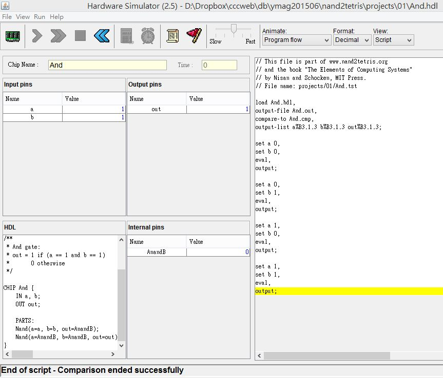

## Nand2Tetris 第一週 -- 布林函數


### 使用內建功能

```
CHIP And {
    IN a, b;
    OUT out;

    BUILTIN And; // 使用內建的 And 功能
}
```

以下為錯誤示範，這種寫法會因為遞迴執行而造成當機。

```
CHIP And {
    IN a, b;
    OUT out;

    PARTS:
    And(a=a, b=b, out=out);
}
```

### 執行方法

安裝好 java JDK 之後，點選 HardwareSimulator.bat 會出現一個視窗程式，請您先將對應的元件程式寫好，然後執行。



舉例而言，先寫好上述的 And.hdl 程式之後，點選 File/Load Script 後選擇 And.tst 檔案，接著按下 Run/Run 的功能，系統會使用 And.tst 這個程式對你的 And.hdl 模組進行測試，如果最後下方出現『End of Script - Comparison ended successfully』的話，那就代表您的元件設計通過測試了。

關於 HardwareSimulator 使用方式的更詳細解說，請參考下列圖片與使用手冊！

* [Simulating a Xor gate](http://www.nand2tetris.org/imgs/HW%20simulator%20Xor.gif)
* [Running a test script](http://www.nand2tetris.org/imgs/HW%20simulator%20test%20script.gif)
* [Simulating the topmost Computer chip](http://www.nand2tetris.org/imgs/HW%20simulator%20Computer%20chip.gif)
* [Hardware Simulator Tutorial (PDF)](http://www.nand2tetris.org/tutorials/PDF/Hardware%20Simulator%20Tutorial.pdf)

一旦第一個程式測試成功後，您就可以嘗試用 nand 閘來兜出所有電路了，畢竟 NandToTetrix 這門課程，就是要告訴我們如何從 nand 閘開始建構電路，然後一路向上經過『多工器、記憶體、處理器、組譯器、編譯器、作業系統』，完整的建構出一台具體而微的電腦。

而這也正是為何我要去修這門課的原因，因為我所想做的『開放電腦計畫』， NandToTetrix 已經先做過一遍了！

以下是我們從 nand 開始構建出所有基本電路的過程。

### 使用 nand 兜出基本邏輯閘

課程網址： <https://class.coursera.org/nand2tetris1-001/wiki/week_1>

[Not.hdl](nand2tetris/projects/01/Not.hdl)

```
CHIP Not {
    IN in;
    OUT out;

    PARTS:
    Nand(a=in, b=in, out=out);
}
```

[And.hdl](nand2tetris/projects/01/And.hdl)

```
CHIP And {
    IN a, b;
    OUT out;

    PARTS:
    Nand(a=a, b=b, out=AnandB);
    Nand(a=AnandB, b=AnandB, out=out);
}
```

[Or.hdl](nand2tetris/projects/01/Or.hdl)

```
CHIP Or {
    IN a, b;
    OUT out;

    PARTS:
    Not(in=a, out=nota);
    Not(in=b, out=notb);
    Nand(a=nota, b=notb, out=out);    
}
```

[Xor.hdl](nand2tetris/projects/01/Xor.hdl)

```
CHIP Xor {
    IN a, b;
    OUT out;

    PARTS:
    Nand (a=a, b=b, out= AnandB);
    Or   (a=a, b=b, out= AorB);
    And  (a=AnandB, b=AorB, out=out);
}
```

[Mux.hdl](nand2tetris/projects/01/Mux.hdl)

```
CHIP Mux {
    IN a, b, sel;
    OUT out;

    PARTS:
    Not(in=sel, out=nsel);
    And(a=a, b=nsel, out=o1);
    And(a=b, b=sel, out=o2);
    Or(a=o1, b=o2, out=out);
}
```

[DMux.hdl](nand2tetris/projects/01/DMux.hdl)

a = (not sel and in)
b = (sel and in)

```
CHIP DMux {
    IN in, sel;
    OUT a, b;

    PARTS:
    Not(in=sel, out=nsel);
    And(a=nsel, b=in, out=a);
    And(a=sel,  b=in, out=b);
}
```

### 建構排線型元件


在建構陣列型的排線元件時，必須要注意的一點是， HardwareSimulator 的陣列，是按高位元至低位元的方式排列的。例如 sel[2] 這樣一個排線，代表的是 sel[1..0]。而 a[8] 這樣的宣告，則代表了 a[7..0] 的順序。

[DMux4Way.hdl](nand2tetris/projects/01/DMux4Way.hdl)

```
CHIP DMux4Way {
    IN in, sel[2];
    OUT a, b, c, d;

    PARTS:
    Not(in=sel[1], out=nsel1);
    Not(in=sel[0], out=nsel0);
    And(a=nsel1,  b=nsel0,  out=sel00);
    And(a=nsel1,  b=sel[0], out=sel01);
    And(a=sel[1], b=nsel0,  out=sel10);
    And(a=sel[1], b=sel[0], out=sel11);
    DMux(in=in, sel=sel00, a=d0, b=a);
    DMux(in=in, sel=sel01, a=d1, b=b);
    DMux(in=in, sel=sel11, a=d2, b=d);
    DMux(in=in, sel=sel10, a=d3, b=c);
}
```

[Not16.hdl](nand2tetris/projects/01/Not16.hdl)

```
CHIP Not16 {
    IN in[16];
    OUT out[16];

    PARTS:
    Not(in=in[15], out=out[15]);
    Not(in=in[14], out=out[14]);
    Not(in=in[13], out=out[13]);
    Not(in=in[12], out=out[12]);
    Not(in=in[11], out=out[11]);
    Not(in=in[10], out=out[10]);
    Not(in=in[9], out=out[9]);
    Not(in=in[8], out=out[8]);
    Not(in=in[7], out=out[7]);
    Not(in=in[6], out=out[6]);
    Not(in=in[5], out=out[5]);
    Not(in=in[4], out=out[4]);
    Not(in=in[3], out=out[3]);
    Not(in=in[2], out=out[2]);
    Not(in=in[1], out=out[1]);
    Not(in=in[0], out=out[0]);
}
```

[And16.hdl](nand2tetris/projects/01/And16.hdl)

```
CHIP And16 {
    IN a[16], b[16];
    OUT out[16];

    PARTS:
    And(a=a[15], b=b[15], out=out[15]);
    And(a=a[14], b=b[14], out=out[14]);
    And(a=a[13], b=b[13], out=out[13]);
    And(a=a[12], b=b[12], out=out[12]);
    And(a=a[11], b=b[11], out=out[11]);
    And(a=a[10], b=b[10], out=out[10]);
    And(a=a[9], b=b[9], out=out[9]);
    And(a=a[8], b=b[8], out=out[8]);
    And(a=a[7], b=b[7], out=out[7]);
    And(a=a[6], b=b[6], out=out[6]);
    And(a=a[5], b=b[5], out=out[5]);
    And(a=a[4], b=b[4], out=out[4]);
    And(a=a[3], b=b[3], out=out[3]);
    And(a=a[2], b=b[2], out=out[2]);
    And(a=a[1], b=b[1], out=out[1]);
    And(a=a[0], b=b[0], out=out[0]);
}
```

[Or16.hdl](nand2tetris/projects/01/Or16.hdl)

```
CHIP Or16 {
    IN a[16], b[16];
    OUT out[16];

    PARTS:
    Or(a=a[15], b=b[15], out=out[15]);
    Or(a=a[14], b=b[14], out=out[14]);
    Or(a=a[13], b=b[13], out=out[13]);
    Or(a=a[12], b=b[12], out=out[12]);
    Or(a=a[11], b=b[11], out=out[11]);
    Or(a=a[10], b=b[10], out=out[10]);
    Or(a=a[9], b=b[9], out=out[9]);
    Or(a=a[8], b=b[8], out=out[8]);
    Or(a=a[7], b=b[7], out=out[7]);
    Or(a=a[6], b=b[6], out=out[6]);
    Or(a=a[5], b=b[5], out=out[5]);
    Or(a=a[4], b=b[4], out=out[4]);
    Or(a=a[3], b=b[3], out=out[3]);
    Or(a=a[2], b=b[2], out=out[2]);
    Or(a=a[1], b=b[1], out=out[1]);
    Or(a=a[0], b=b[0], out=out[0]);
}
```

[Mux16.hdl](nand2tetris/projects/01/Mux16.hdl)

```
CHIP Mux16 {
    IN a[16], b[16], sel;
    OUT out[16];

    PARTS:
    Mux(a=a[15], b=b[15], sel=sel, out=out[15]);
    Mux(a=a[14], b=b[14], sel=sel, out=out[14]);
    Mux(a=a[13], b=b[13], sel=sel, out=out[13]);
    Mux(a=a[12], b=b[12], sel=sel, out=out[12]);
    Mux(a=a[11], b=b[11], sel=sel, out=out[11]);
    Mux(a=a[10], b=b[10], sel=sel, out=out[10]);
    Mux(a=a[9],  b=b[9],  sel=sel, out=out[9]);
    Mux(a=a[8],  b=b[8],  sel=sel, out=out[8]);
    Mux(a=a[7],  b=b[7],  sel=sel, out=out[7]);
    Mux(a=a[6],  b=b[6],  sel=sel, out=out[6]);
    Mux(a=a[5],  b=b[5],  sel=sel, out=out[5]);
    Mux(a=a[4],  b=b[4],  sel=sel, out=out[4]);
    Mux(a=a[3],  b=b[3],  sel=sel, out=out[3]);
    Mux(a=a[2],  b=b[2],  sel=sel, out=out[2]);
    Mux(a=a[1],  b=b[1],  sel=sel, out=out[1]);
    Mux(a=a[0],  b=b[0],  sel=sel, out=out[0]);
}
```

[Or8Way.hdl](nand2tetris/projects/01/Or8Way.hdl)

```
CHIP Or8Way {
    IN in[8];
    OUT out;

    PARTS:
    Or(a=in[7], b=in[6], out=or76);
    Or(a=in[5], b=in[4], out=or54);
    Or(a=in[3], b=in[2], out=or32);
    Or(a=in[1], b=in[0], out=or10);
    Or(a=or76, b=or54, out=or74);
    Or(a=or32, b=or10, out=or30);
    Or(a=or74, b=or30, out=out);
}
```

[DMux8Way.hdl](nand2tetris/projects/01/DMux8Way.hdl)

```
CHIP DMux8Way {
    IN in, sel[3];
    OUT a, b, c, d, e, f, g, h;

    PARTS:
    Not(in=sel[2], out=nsel2);
    And(a=in, b=sel[2], out=s2h);
    And(a=in, b=nsel2,  out=s2l);
    DMux4Way(in=s2h, sel=sel[0..1], a=e, b=f, c=g, d=h);
    DMux4Way(in=s2l, sel=sel[0..1], a=a, b=b, c=c, d=d);
}
```

[Mux4Way16.hdl](nand2tetris/projects/01/Mux4Way16.hdl)

```
CHIP Mux4Way16 {
    IN a[16], b[16], c[16], d[16], sel[2];
    OUT out[16];

    PARTS:
    Mux16(a=a, b=b, sel=sel[0], out=outab);
    Mux16(a=c, b=d, sel=sel[0], out=outcd);
    Mux16(a=outab, b=outcd, sel=sel[1], out=out);
}
```

[Mux8Way16.hdl](nand2tetris/projects/01/Mux8Way16.hdl)

```
CHIP Mux8Way16 {
    IN a[16], b[16], c[16], d[16],
       e[16], f[16], g[16], h[16],
       sel[3];
    OUT out[16];

    PARTS:
    Mux4Way16(a=a, b=b, c=c, d=d, sel=sel[0..1], out=outad);
    Mux4Way16(a=e, b=f, c=g, d=h, sel=sel[0..1], out=outeh);
    Mux16(a=outad, b=outeh, sel=sel[2], out=out);
}
```

### 結語

原本預期我應該可以輕輕鬆鬆的一下就做完了，結果還是花了一整個早上才做完，這門課還真是有點硬阿！

而且，這才是第一週的課程而已。

想必接下來將會有艱苦的挑戰！