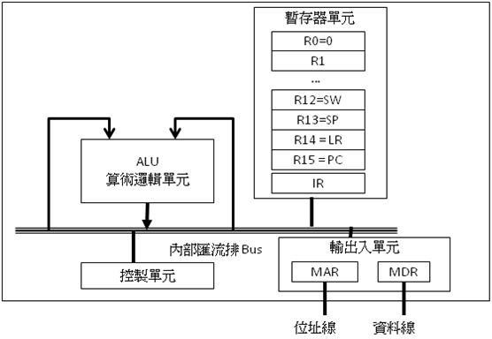
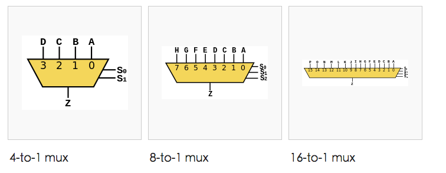
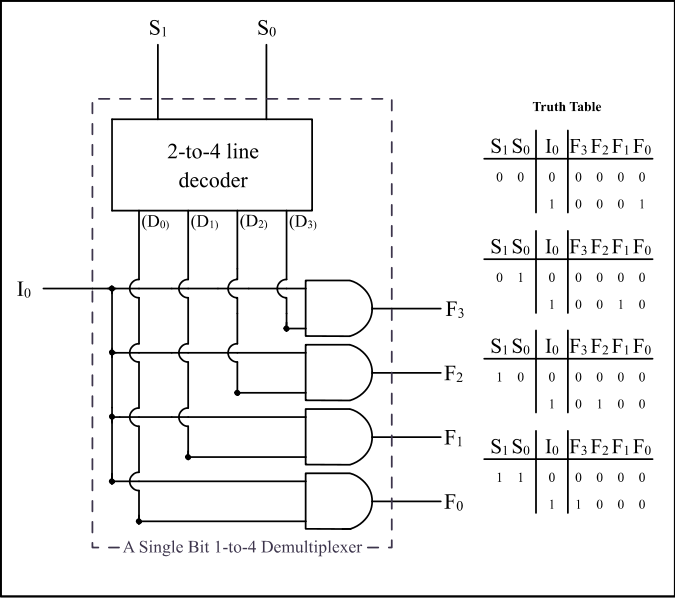

## Nand2Tetris 第 1 週 -- 布林函數

### 電腦的基本結構

在 2014 年 10 月份的 [少年科技人雜誌第一期:電腦的歷史、工業與結構](http://programmermagazine.github.io/y201410/htm/home.html) 內容中，我們曾經介紹過 [透視電腦的內部結構](http://programmermagazine.github.io/y201410/htm/focus2.html) 這個主題。

從該文中我們看到了電腦的基本結構如下：


該架構中的核心是處理器，而處理器本身又是一個與馮紐曼架構類似的微型結構。



上述的結構是由很多大尺度的構件所組成的，但是在微觀的尺度上，這些構件可以由更細微的『邏輯閘』所組成，以下是一些常見的邏輯閘。


在上述這些邏輯閘中，NAND 元件具有全能性，也就是其它邏輯閘都可以由一群 NAND 所組合而成，因此我們只需要很多的 NAND 閘，就可以建構出所有其他的邏輯閘，然後再進一步組合出所有的數位電路，一路向上建構出處理器與電腦。

而 Nand to Tetris 這個名稱的意義，也就是企圖從 NAND 元件開始，一路向上建構出整台電腦，然後開始寫出組譯器，編譯器，虛擬機，作業系統等軟件，最後在這些系統軟件的基礎上撰寫一些方塊遊戲，像是俄羅斯方塊等等。

### 如何設計電腦

Shimon Schocken 與 Noam Nisan 兩位教授應該是希望透過這樣一個從下到上的完整建構過程，讓學生能夠徹底的瞭解電腦的設計原理，並且能自己動手設計出一台電腦。

接著，且讓我用自問自答的方式，來唱一段雙簧！

(1) 問題是，組合出一顆處理器需要多少閘呢？

> 這個問題的答案是，數百萬個邏輯閘才能組合出一顆處理器。

(2) 這樣的話，我們花一輩子都可能組不出來啊？那我們要怎麼開始呢？

> 現在設計處理器，已經不需要用手來組裝邏輯閘了，因為我們有更好的方式，那個方式就是寫程式來設計電腦。

(3) 寫程式來設計電腦，那要用什麼程式語言呢？

> 這種用來設計電腦硬體的語言，統稱為『硬體描述語言』(Hardware Description Language, HDL)，目前最常用的硬體描述語言有兩種，分別是 VHDL 與 Verilog。

(4) 那在這一門課裡，我們是用哪種硬體描述語言呢？是 VHDL 還是 Verilog 呢？

> 這個問題的答案是，兩者都不是。
> 
> 這門課的硬體描述語言也是由老師他們的團隊自製的小型 HDL，名稱為 HackHDL。

(5) HackHDL 和 VHDL, Verilog 有差別嗎？差別在哪裡呢？ 

> 有差別，HackHDL的功能非常陽春，只能採用元件和拉線的方式來設計，沒有 VHDL, Verilog 當中的流程式寫法，所以也不支援 if, else, case, always, initial 等語法。 

(6) 為什麼要採用這麼陽春的工具，這對我們的學習是不是會有負面影響？

> 依我的經驗是，這對學習有正面影響，因為 HackHDL 強迫你要用接線的方式設計硬體，不能採用那種高階寫法，因此更很扎實地瞭解電腦的設計原理，不會有跳空的情況。
> 
> 如果採用高階語法，在設計完成後心裡很容易留下一大堆疑問，但採用 HackHDL 則會很有踏實感，因為一切線路都是你扎扎實實設計出來的。

好了，釐清這些疑問之後，我們就可以開始來學習硬體描述語言了。

### 硬體描述語言

首先，就讓我用一個 Not.hdl 的範例來說明 HackHDL 硬體描述語言的語法吧！

我們可以用 Nand 閘來建構出 Not 閘，只要將 Nand 的兩個輸入都接在一起就行了。Nand 閘有兩個輸入參數 a,b 與一個輸出 out，我們透過下列的 Nand(a=in, b=in, out=out) 語句將 a, b 都接到 in 這條輸入線中，於是 Nand 閘就變成了一個 Not 閘。

```
CHIP Not {
    IN in;
    OUT out;

    PARTS:
    Nand(a=in, b=in, out=out);
}
```

事實上，在 HackHDL 的系統中，早就已經將 Nand 閘內建在裡面了，因此我們不需要額外宣告一個 Nand 閘，不過如果我們真的想自己宣告 Nand 閘的話，也可以採用 BUILTIN 這個語句，這樣就可以接上系統內建的元件了。 

```
CHIP Nand {
    IN a, b;
    OUT out;

    BUILTIN Nand; // 使用內建的 Nand 功能
}
```

但是，您不可以在某元件裡再度以如下的方式引用自己，否則將會因為遞迴執行而導致當機。

```
CHIP Nand {
    IN a, b;
    OUT out;

    PARTS:
    Nand(a=a, b=b, out=out);
}
```

事實上，不止 Nand 元件有預設版本，整個 nand2tetris 習題中的每個作業都有預設版本。當您某個作業寫不出來的時候，系統會用預設的版本代替，這樣就不會讓該作業卡住您的學習，整個學習過程還是可以順利進行。

### 執行方法

安裝好 java JDK 之後，點選 HardwareSimulator.bat 會出現一個視窗程式，請您先將對應的元件程式寫好，然後執行。


舉例而言，先寫好上述的 And.hdl 程式之後，點選 File/Load Script 後選擇 And.tst 檔案，接著按下 Run/Run 的功能，系統會使用 And.tst 這個程式對你的 And.hdl 模組進行測試，如果最後下方出現『End of Script - Comparison ended successfully』的話，那就代表您的元件設計通過測試了。

關於 HardwareSimulator 使用方式的更詳細解說，請參考下列圖片與使用手冊！

* [Simulating a Xor gate](http://www.nand2tetris.org/imgs/HW%20simulator%20Xor.gif)
* [Running a test script](http://www.nand2tetris.org/imgs/HW%20simulator%20test%20script.gif)
* [Simulating the topmost Computer chip](http://www.nand2tetris.org/imgs/HW%20simulator%20Computer%20chip.gif)
* [Hardware Simulator Tutorial (PDF)](http://www.nand2tetris.org/tutorials/PDF/Hardware%20Simulator%20Tutorial.pdf)

一旦第一個程式測試成功後，您就可以嘗試用 nand 閘來兜出所有電路了，畢竟 NandToTetrix 這門課程，就是要告訴我們如何從 nand 閘開始建構電路，然後一路向上經過『多工器、記憶體、處理器、組譯器、編譯器、作業系統』，完整的建構出一台具體而微的電腦。

而這也正是為何我要去修這門課的原因，因為我所想做的『開放電腦計畫』， NandToTetrix 已經先做過一遍了！

以下是我們從 nand 開始構建出所有基本電路的過程。

### 使用 nand 兜出基本邏輯閘

第一章的習題主要是請大家嘗試從 nand 閘開始，一步一步的建構出 Not, And, Or, Xor, Mux, DMux 等單位元的邏輯元件，然後再用很多組這些元件去組成 16 位元的邏輯元件，像是 Not16, And16, Or16, Mux16, Or8Way, Mux4Way16, Mux8Way16, DMux4Way, DMux8Way 等邏輯元件吧！

如果您還不了解各種邏輯閘的定義與功能，可以參考下列文件！

* [維基百科：邏輯閘](http://zh.wikipedia.org/wiki/%E9%82%8F%E8%BC%AF%E9%96%98)
* [Wikipedia:NAND logic]

在上述的 [Wikipedia:NAND logic] 文件當中，詳細的描述了如何用 nand 來建構出 not, and, or 的方法，


以下是 not 閘的習題，您必須在 // Put your code here: 這行下面將成是碼填入。

```
CHIP Not {
    IN in;
    OUT out;

    PARTS:
    // Put your code here:
}
```

於是筆者將 下列這行填入，就完成了這題作業，不過還是需要用 HardwareSimulator 測試一遍，確定結果正確才行。

```
    Nand(a=in, b=in, out=out);
```


接著我們如上圖用兩個 nand 閘建構出一個 and 閘，請讀者自行嚐試看看。

```
CHIP And {
    IN a, b;
    OUT out;

    PARTS:
    // Put your code here:
}
```


有了這些電路圖之後，相信您應該可以很容易地寫出對應的 HackHDL 程式了，以下是我用 nand 建構 or 閘的 HackHDL 程式碼，提供給您參考！

```
CHIP Or {
    IN a, b;
    OUT out;

    PARTS:
    Not(in=a, out=nota);
    Not(in=b, out=notb);
    Nand(a=nota, b=notb, out=out);    
}
```

然後我們可以建構出 xor 閘，題目如下：

```
CHIP Xor {
    IN a, b;
    OUT out;

    PARTS:
    // Put your code here:
}
```

另外，還有一類重要的邏輯元件稱為多工器 (Multiplexer, MUX) ，這種元件可以從很多組輸入裏選擇出指定的那組輸出，以下是一個二選一的多工器圖示與習題。


```
CHIP Mux {
    IN a, b, sel;
    OUT out;

    PARTS:
    // Put your code here:
}
```

如果把多工器的功能反過來看，就會設計出一種稱為解多工器 DMUX 的元件，習題如下。

```
CHIP DMux {
    IN in, sel;
    OUT a, b;

    PARTS:
    // Put your code here:
}
```

然後我們可以將這些元件的輸入變成 16 位元的，於是就會有下列這些習題。


```
/**
 * 16-bit Not:
 * for i=0..15: out[i] = not in[i]
 */

CHIP Not16 {
    IN in[16];
    OUT out[16];

    PARTS:
    // Put your code here:
}
```

```
/**
 * 16-bit bitwise And:
 * for i = 0..15: out[i] = (a[i] and b[i])
 */

CHIP And16 {
    IN a[16], b[16];
    OUT out[16];

    PARTS:
    // Put your code here:
}
```

```
/**
 * 16-bit bitwise Or:
 * for i = 0..15 out[i] = (a[i] or b[i])
 */

CHIP Or16 {
    IN a[16], b[16];
    OUT out[16];

    PARTS:
    // Put your code here:
}
```

```
/**
 * 16-bit multiplexor: 
 * for i = 0..15 out[i] = a[i] if sel == 0 
 *                        b[i] if sel == 1
 */

CHIP Mux16 {
    IN a[16], b[16], sel;
    OUT out[16];

    PARTS:
    // Put your code here:
}
```

當然，也可以設計從更多組輸入選一組的多工器，如下圖所示。



或者設計更多選擇線的解多工器，以下是一個 1 對 4 解多工器的電路圖，其中用到了解碼器元件 （當然您也可以跳過解碼器直接實作）。




```
/**
 * 4-way 16-bit multiplexor:
 * out = a if sel == 00
 *       b if sel == 01
 *       c if sel == 10
 *       d if sel == 11
 */

CHIP Mux4Way16 {
    IN a[16], b[16], c[16], d[16], sel[2];
    OUT out[16];

    PARTS:
    // Put your code here:
}
```

```
/**
 * 8-way 16-bit multiplexor:
 * out = a if sel == 000
 *       b if sel == 001
 *       etc.
 *       h if sel == 111
 */

CHIP Mux8Way16 {
    IN a[16], b[16], c[16], d[16],
       e[16], f[16], g[16], h[16],
       sel[3];
    OUT out[16];

    PARTS:
    // Put your code here:
}
```

```
/**
 * 4-way demultiplexor:
 * {a, b, c, d} = {in, 0, 0, 0} if sel == 00
 *                {0, in, 0, 0} if sel == 01
 *                {0, 0, in, 0} if sel == 10
 *                {0, 0, 0, in} if sel == 11
 */

CHIP DMux4Way {
    IN in, sel[2];
    OUT a, b, c, d;

    PARTS:
    // Put your code here:
}
```

```
/**
 * 8-way demultiplexor:
 * {a, b, c, d, e, f, g, h} = {in, 0, 0, 0, 0, 0, 0, 0} if sel == 000
 *                            {0, in, 0, 0, 0, 0, 0, 0} if sel == 001
 *                            etc.
 *                            {0, 0, 0, 0, 0, 0, 0, in} if sel == 111
 */

CHIP DMux8Way {
    IN in, sel[3];
    OUT a, b, c, d, e, f, g, h;

    PARTS:
    // Put your code here:
}
```

還有之後應該會用到的 8 輸入或閘的習題。

```
/**
 * 8-way Or: 
 * out = (in[0] or in[1] or ... or in[7])
 */

CHIP Or8Way {
    IN in[8];
    OUT out;

    PARTS:
    // Put your code here:
}
```

接著，就請上課程網站看看影片，然後把第一週的作業完成吧！

課程網址： <https://class.coursera.org/nand2tetris1-001/wiki/week_1>

[Wikipedia:NAND logic]:http://en.wikipedia.org/wiki/NAND_logic

### 結語

以下是第一週習題的題目網址，請務必盡可能靠自己的能力完成，這樣才能深度理解這些設計的實作方法。

* <http://www.nand2tetris.org/01.php>

雖然兩位老師請同學不要將解答上傳到公開網路上，但還是有人上傳了，所以如果您真的做不出來或卡住了，還是可以參考一下答案，以下是 havivha 所提供的參考答案！

* <https://github.com/havivha/Nand2Tetris/tree/master/01>

原本預期我應該可以輕輕鬆鬆的一下就做完了，結果還是花了一整個早上才做完，這門課還真是有點硬阿！

而且，這才是第一週的課程而已。

想必接下來將會有艱苦的挑戰！

