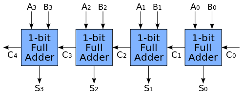

## Nand2Tetris 第 2 週 -- 布林算術

在第一週的作業中，我們從 nand 開始做出了Not, And, Or, Xor, Mux, DMux 等邏輯元件，並且進一步擴充為 Not16, And16, Or16, Mux16, Or8Way, Mux4Way16, Mux8Way16, DMux4Way, DMux8Way 的版本了。

但是，我們還沒讓電腦可以進行計算，特別是讓電腦作加減法，在這週的課程中，我們主要想做出一個完整的加法器，然後進一步做出 CPU 的心臟 -- 算術邏輯單元。

要做出 16 位元的加法器將兩個 16 位元的二進位數字 a[16],b[16] 相加起來，必須要能先做出 1 位元的二進位加法，這種將兩個位元相加的基礎元件稱為半加器，圖示與習題如下。


```
/**
 * Computes the sum of two bits.
 */

CHIP HalfAdder {
    IN a, b;    // 1-bit inputs
    OUT sum,    // Right bit of a + b 
        carry;  // Left bit of a + b

    PARTS:
    // Put you code here:
}
```

但是，要能夠做出 16 位元的加法器，不能夠只拿兩個位元相加，而必須能夠進行三個位元的加法才行（因為可能會有進位）。因此我們需要能做三個位元相加的 FullAdder，以下是其電路圖與習題。


```
/**
 * Computes the sum of three bits.
 */

CHIP FullAdder {
    IN a, b, c;  // 1-bit inputs
    OUT sum,     // Right bit of a + b + c
        carry;   // Left bit of a + b + c

    PARTS:
    // Put you code here:
}
```

一旦我們設計出一個元件之後，就可以用方塊的方式表示它，只要將輸入輸出線拉出來就行了，以下是全加器的方塊圖。


接著，我們可以串接很多個全加器，形成任意位數的加法器，以下是串接四個全加器所形成的四位元加法器。



當然，我們也可以做出更多位元的加法器，在以下習題裏就要求我們做出 16 位元的加法器。

```
/**
 * Adds two 16-bit values.
 * The most significant carry bit is ignored.
 */

CHIP Add16 {
    IN a[16], b[16];
    OUT out[16];

    PARTS:
   // Put you code here:
}
```

一旦你做出了 16 位元的加法器，那就可以輕易的做出 16 位元的遞增器 Inc16.hdl

```
/**
 * 16-bit incrementer:
 * out = in + 1 (arithmetic addition)
 */

CHIP Inc16 {
    IN in[16];
    OUT out[16];

    PARTS:
   // Put you code here:
}
```

然後就是本章的重頭戲，運用這兩章的元件做出一個完整的算術邏輯單元，其功能要求與作業內容如下。

```
/**
 * The ALU (Arithmetic Logic Unit).
 * Computes one of the following functions:
 * x+y, x-y, y-x, 0, 1, -1, x, y, -x, -y, !x, !y,
 * x+1, y+1, x-1, y-1, x&y, x|y on two 16-bit inputs, 
 * according to 6 input bits denoted zx,nx,zy,ny,f,no.
 * In addition, the ALU computes two 1-bit outputs:
 * if the ALU output == 0, zr is set to 1; otherwise zr is set to 0;
 * if the ALU output < 0, ng is set to 1; otherwise ng is set to 0.
 */

// Implementation: the ALU logic manipulates the x and y inputs
// and operates on the resulting values, as follows:
// if (zx == 1) set x = 0        // 16-bit constant
// if (nx == 1) set x = !x       // bitwise not
// if (zy == 1) set y = 0        // 16-bit constant
// if (ny == 1) set y = !y       // bitwise not
// if (f == 1)  set out = x + y  // integer 2's complement addition
// if (f == 0)  set out = x & y  // bitwise and
// if (no == 1) set out = !out   // bitwise not
// if (out == 0) set zr = 1
// if (out < 0) set ng = 1

CHIP ALU {
    IN  
        x[16], y[16],  // 16-bit inputs        
        zx, // zero the x input?
        nx, // negate the x input?
        zy, // zero the y input?
        ny, // negate the y input?
        f,  // compute out = x + y (if 1) or x & y (if 0)
        no; // negate the out output?

    OUT 
        out[16], // 16-bit output
        zr, // 1 if (out == 0), 0 otherwise
        ng; // 1 if (out < 0),  0 otherwise

    PARTS:
   // Put you code here:
}
```

這個 ALU 將會是 HackCPU 處理器的心臟，也可以說是這門課最重要的一個元件了。

### 注意事項

但是，在實作之前建議各位先閱讀一下 Nand2tetris 課程提供的 [HDL Survival Guide](http://www.nand2tetris.org/software/HDL%20Survival%20Guide.html) 文件，這對您會很有幫助。

其中有幾點要注意的，筆者在此先提醒大家。

首先是 HackHDL 的輸入裏不能使用 0, 1, 但是可以使用 false, true ，其中的 true 代表一個全數為 1 的真值，傳入陣列輸入的話，就會變成 11111.... ，而 false 則代表 00000.....

注意下列範例，您可以將某些線路分別輸出或輸入

另外，我們可以用 a[4..11] 這樣的語法取出或設定 a 中第 4 到 11 位元的內容，如果是像 Or8Way (in=notIn[4..11], out=out) 這樣的語句，那就是將 notIn[4..11] 共 8 個位元取出傳入 in 線路當中，但是如果用 Something16(in=in, out[4..11]=notIn) 這樣的語句，則是將 notIn 傳入到 out[4..11] 線路當中，兩者的意義是很不相同的，以下是 [HDL Survival Guide](http://www.nand2tetris.org/software/HDL%20Survival%20Guide.html) 裏節錄的一段說明，提供給讀者參考。

```
Sub-busing can only be used on buses that are named in the IN and OUT statements of an HDL file, or inputs and outputs of the chip-parts used in the PARTS section. If you need a sub-bus of an internal bus, you must create the narrower bus as an output from a chip-part. For example:

	CHIP Foo {
	   IN in[16];
	   OUT out;
	PARTS:
	   Something16 (in=in, out=notIn);
	   Or8Way (in=notIn[4..11], out=out);
	}

This implementation causes an error on the Or8Way statement. This needs to be coded as:

	   Something16 (in=in, out[4..11]=notIn);
	   Or8Way (in=notIn, out=out);

Multiple Outputs

Sometimes you need more than one sub-bus connected to the output of a chip-part. Simply add more than one out= connection to the chip-part definition.

	CHIP Foo {
	   IN in[16];
	   OUT out[8];
	   PARTS:
	       Not16 (in=in, out[0..7]=low8, out[8..15]=high8);
	       Something8 (a=low8, b=high8, out=out);
	}

This also works if you want to use an output of a chip in further computations.

	CHIP Foo {
	IN a, b, c;
	OUT out1, out2;
	PARTS:
	   Something (a=a, b=b, out=x, out=out1);
	   Whatever (a=x, b=c, out=out2);
	}
```


### 結語

現在建議您可以上去看看影片並且實作第二週的習題了，以下是課程網址。

課程網址： <https://class.coursera.org/nand2tetris1-001/wiki/week_2>

以下是第二週習題的題目網址，請務必盡可能靠自己的能力完成，這樣才能深度理解這些設計的實作方法。

* <http://www.nand2tetris.org/02.php>

雖然兩位老師請同學不要將解答上傳到公開網路上，但還是有人上傳了，所以如果您真的做不出來或卡住了，還是可以參考一下答案，以下是 havivha 所提供的參考答案！

* <https://github.com/havivha/Nand2Tetris/tree/master/02>


筆者經過半天的奮戰，終於把第二週的功課做完了！

由於對 Nand2tetris 課程的 HDL 的語法不瞭解，還著實吃了一些苦頭，除錯了很久！

雖然如此， Nand2tetris 已經做得很好了，這些時間花得還是很值得！


