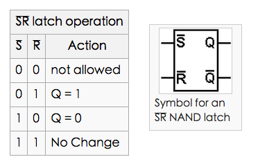

## Nand2Tetris 第 3 週 -- 記憶體

雖然 nand2tetris 第二週已經教到了加法器與 ALU 等有點複雜度的元件之設計，但是卻還留下了一類關鍵性元件還沒有實作，那就是記憶性元件。

第三週的重點是記憶體的設計，課程會從一位元的記憶體開始實作，之後擴大為 16 位元暫存器。接著做出容量大小分別為 8, 64, 512, 4K, 16K 的記憶體。

一位元的記憶體是由正反器所構成的，而正反器又是由閂鎖器組合成的，以下是一種由NAND 閘組成的閂鎖器 (Latch)。


上述閂鎖器是由兩個 NAND 互相回饋的線路所組成，這種線路可以將一個位元鎖在裡面，然後又可以透過剩下的兩條輸入線進行設定或清除的動作，其真值表與圖示如下。



但是上述這種閂鎖器並不好用，因為有些不允許的狀況會出現，因此我們會用兩個閂鎖器組合成有 enable 的 D 型閂鎖器如下。


然後為了加上時脈控制的 clock 訊號，再用兩個 D 型閂鎖器組合成正反器。


這種正反器就可以用來儲存一個位元，並且有良好的可控制性。

您可以參考以下文件以便進一步瞭解以有關閂鎖器與正反器的技術內容。

* [Wikipedia:Flip-flop (electronics)](http://en.wikipedia.org/wiki/Flip-flop_%28electronics%29)
* [維基百科:正反器](http://zh.wikipedia.org/wiki/%E8%A7%A6%E5%8F%91%E5%99%A8)

有了一個位元的儲存器，就可以一路擴充上去，建構出 16 位元的暫存器，然後形成暫存器群。

Nand2tetris 課程內建了 D 型的正反器元件，稱為 DFF，您可以透過 DFF 來組成一位元記憶體，而不需要從 NAND 開始建構。

於是我們可以用 DFF 來建構可以儲存 1 位元的容器，習題如下：

```
/**
 * 1-bit register:
 * If load[t] == 1 then out[t+1] = in[t]
 *                 else out does not change (out[t+1] = out[t])
 */

CHIP Bit {
    IN in, load;
    OUT out;

    PARTS:
    // Put your code here:
}

```

接著就可以用 16 的 Bit 做出 16 位元暫存器。

```
/**
 * 16-bit register:
 * If load[t] == 1 then out[t+1] = in[t]
 * else out does not change
 */

CHIP Register {
    IN in[16], load;
    OUT out[16];

    PARTS:
    // Put your code here:
}
```

接著搭配第一週設計的多工器 (MUX) 與解多工器 (DMUX)，就可以控制很多記憶單元，做出容量大小分別為 8, 64, 512, 4K, 16K 的記憶體了。 

```
/**
 * Memory of 8 registers, each 16 bit-wide. Out holds the value
 * stored at the memory location specified by address. If load==1, then 
 * the in value is loaded into the memory location specified by address 
 * (the loaded value will be emitted to out from the next time step onward).
 */

CHIP RAM8 {
    IN in[16], load, address[3];
    OUT out[16];

    PARTS:
    // Put your code here:
}
```

```
/**
 * Memory of 64 registers, each 16 bit-wide. Out holds the value
 * stored at the memory location specified by address. If load==1, then 
 * the in value is loaded into the memory location specified by address 
 * (the loaded value will be emitted to out from the next time step onward).
 */

CHIP RAM64 {
    IN in[16], load, address[6];
    OUT out[16];

    PARTS:
    // Put your code here:
}
```

```
/**
 * Memory of 512 registers, each 16 bit-wide. Out holds the value
 * stored at the memory location specified by address. If load==1, then 
 * the in value is loaded into the memory location specified by address 
 * (the loaded value will be emitted to out from the next time step onward).
 */

CHIP RAM512 {
    IN in[16], load, address[9];
    OUT out[16];

    PARTS:
    // Put your code here:
}
```

```
/**
 * Memory of 4K registers, each 16 bit-wide. Out holds the value
 * stored at the memory location specified by address. If load==1, then 
 * the in value is loaded into the memory location specified by address 
 * (the loaded value will be emitted to out from the next time step onward).
 */

CHIP RAM4K {
    IN in[16], load, address[12];
    OUT out[16];

    PARTS:
    // Put your code here:
}
```

```
/**
 * Memory of 16K registers, each 16 bit-wide. Out holds the value
 * stored at the memory location specified by address. If load==1, then 
 * the in value is loaded into the memory location specified by address 
 * (the loaded value will be emitted to out from the next time step onward).
 */

CHIP RAM16K {
    IN in[16], load, address[14];
    OUT out[16];

    PARTS:
    // Put your code here:
}
```

現在建議您可以上去看看影片並且實作第三週的習題了，以下是課程網址。

課程網址： <https://class.coursera.org/nand2tetris1-001/wiki/week_3>

以下是第二週習題的題目網址，請務必盡可能靠自己的能力完成，這樣才能深度理解這些設計的實作方法。

* <http://www.nand2tetris.org/03.php>

雖然兩位老師請同學不要將解答上傳到公開網路上，但還是有人上傳了，所以如果您真的做不出來或卡住了，還是可以參考一下答案，以下是 havivha 所提供的參考答案！

* <https://github.com/havivha/Nand2Tetris/tree/master/03>

接著就該由您來建構出各種大小的記憶體了。


