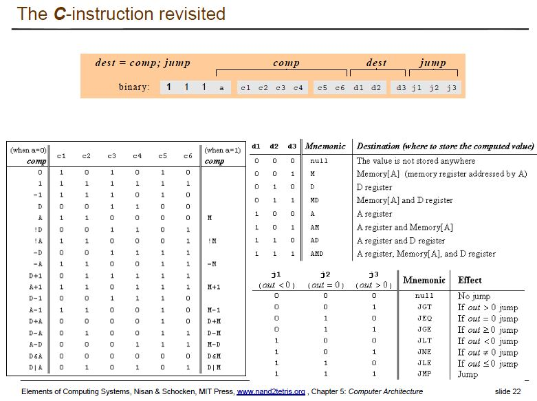

## Nand2Tetris 第 4 週 -- 機器語言

從第四週開始，您必須要學習撰寫 HackCPU 處理器組合語言 （HackCPU 處理器就是 nand2tetris 要你在作業中實作的那顆）， 此時您就必須開始使用 CPUEmulator 這個程式來測試您所撰寫的組合語言，並觀察這些組合語言是如何被轉換為機器碼的。

授權聲明： 本文的截圖來自 [nand2tetris 第四章投影片] ，該文並非採用創作共用授權，使用時請注意這點，避免侵權。 在此我們僅按著作權法中的合理使用原則，擷取幾張圖片，若您是該作品擁有者且認為此擷取行為不妥，請告訴我們，我們會配合移除。

### HackCPU 的組合語言

那麼， HackCPU 的組合語言到底長什麼樣子呢？ 以下是我們從 [nand2tetris 第四章投影片] 中抽取出來的一個範例，這個 HackCPU 組合語言可以用來計算 1+2+...+10。

```
	// Adds 1+...+10.
	@i // i refers to some RAM location
	M=1 // i=1
	@sum // sum refers to some RAM location
	M=0 // sum=0
(LOOP)
	@i
	D=M // D = i
	@10
	D=D-A // D = i - 10
	@END
	D;JGT // If (i-100) > 0 goto END
	@i
	D=M // D = i
	@sum
	M=D+M // sum += i
	@i
	M=M+1 // i++
	@LOOP
	0;JMP // Got LOOP
(END)
	@END
	0;JMP // Infinite loop
```

### 指令格式與寫法

Nand2tetris 課程所要求要設計的處理器稱為 HackCPU，HackCPU 的有兩種型態的指令，第一種是 A 型態的指令，用來指定某個記憶體位址， A 型指令的寫法是由 @ 符號開頭的，如下所示：

```
@value // 代表 A=value
```

第二種型態的指令是 C 型指令，通常用來進行運算 (Computation, C)，其指令格式如下， C 型指令包含了 compute, dest, jump 等欄位。

其中的 A 指令會改變 A 暫存器，並以 A 為位址將讀出資料 M 。

而比較複雜 C 型指令則是做運算，根據 compute, dest, jump 欄位內容不同會進行不同的動作，這些動作總結如下。


<center>說明：上圖來自 [nand2tetris 第四章投影片] </center>

### 範例

接著讓我們看一些 HackCPU 的指令範例，以便進一步瞭解其組合語言的寫法。

範例一： if (3-5 ==0) goto 100 else goto 200

```
@3      // A = 3
D = M   // D = M = memory[A] = memory[3]
@5      // A = 5
D = D-A // D = D-5
@100    // A = 100
D; JEQ  // if (D==0) goto 100      ; goto 會跳到 A 暫存器的位址。
@200    // A = 200
0; JMP  // goto 200
```

只要看懂這些組合語言程式，應該就可以開始寫習題了。

### 符號與記憶體映射

為了讓寫程式更方便，HackCPU 的組合語言裏定義了一些符號，可以讓撰寫者引用。其中 R0 .. R15 分別代表記憶體位址 0 .. 15，另外 SCREEN 代表位址 16384，這是螢幕記憶體映射區的開頭。而 KBD 代表位址 24576 ，這是鍵盤碼的記憶體映射位址。

以下是 Hack Computer 的記憶體映射圖，透過這樣的映射，您可以用 HackCPU 的組合語言取得鍵盤輸入，或者在螢幕上繪製圖形與文字。 


### 第四週習題

本週習題主要是要求學員撰寫兩個 HackCPU 的組合語言程式，第一個稱為 Fill.asm，功能是在有任何按鍵被按下時，能夠讓螢幕變成黑色的，如果沒有任何按鍵被按下的話，那螢幕就是白色的。

習題： Fill.asm

```
// Runs an infinite loop that listens to the keyboard input. 
// When a key is pressed (any key), the program blackens the screen,
// i.e. writes "black" in every pixel. When no key is pressed, the
// program clears the screen, i.e. writes "white" in every pixel.

// Put your code here.
```


第二個作業是要寫出可以進行兩數相乘功能的 mult.asm 組合語言，這個習題設計的目的是讓原本不支援乘法功能的 HackCPU ，也可以透過組合語言的擴充函數，進行乘法計算，這種函數通常也是作業系統的一部分。

習題： Mult.asm

```
// Multiplies R0 and R1 and stores the result in R2.
// (R0, R1, R2 refer to RAM[0], RAM[1], and RAM[2], respectively.)

// Put your code here.
```

現在建議您可以上去看看影片並且實作第四週的習題了，以下是課程網址。

課程網址： <https://class.coursera.org/nand2tetris1-001/wiki/week_4>

以下是第四週習題的題目網址，請務必盡可能靠自己的能力完成，這樣才能深度理解這些設計的實作方法。

* <http://www.nand2tetris.org/04.php>

雖然兩位老師請同學不要將解答上傳到公開網路上，但還是有人上傳了，所以如果您真的做不出來或卡住了，還是可以參考一下答案，以下是 havivha 所提供的參考答案！

* <https://github.com/havivha/Nand2Tetris/tree/master/04>

寫好之後，您可以用 CPUEmulator 這個程式進行測試，看看自己的執行結果是否正確。

關於 CPUEmulator 的用法請參考下列文件。

* [CPU Emulator Tutorial](http://www.nand2tetris.org/tutorials/PDF/CPU%20Emulator%20Tutorial.pdf)

希望大家都能順利完成作業囉！ Good Luck !

[nand2tetris 第四章投影片]:http://www.nand2tetris.org/lectures/PDF/lecture%2004%20machine%20language.pdf

