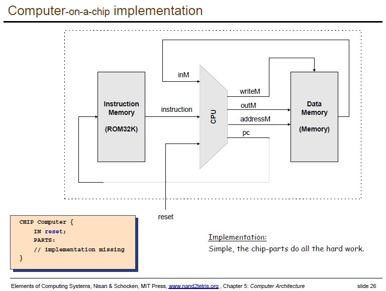

## Nand2Tetris 第 5 週 -- 計算機結構

授權聲明： 本文的截圖來自 [nand2tetris 第五章投影片](http://www.nand2tetris.org/lectures/PDF/lecture%2005%20computer%20architecture.pdf) ，該文並未聲明授權方式，使用時請注意這點，避免侵權。 在此我們僅按著作權法中的合理使用原則，擷取幾張圖片，若您是該作品擁有者且認為此擷取行為不妥，請告訴我們，我們會配合移除。

在第四週的課程中，我們學會了 HackCPU 的組合語言。

一旦瞭解了組合語言之後，我們就可以從指令集開始，設計處理器了。

到目前為止，我們已經實作了『基本邏輯閘，多工與解多工器，加法器，ALU，暫存器，記憶體』等元件了，而這週是整個硬體課程的重頭戲，要實作出 HackCPU 處理器與整台 HackComputer 電腦，以下是我們這幾週的習題列表。


我們在這週必須根據下列的電路圖，用 HackHDL 硬體描述語言設計出 HackCPU，其中應該會運用到之前設計的很多元件，像是『ALU，暫存器，多工器』等等。


您必須在下列 CPU.hdl 模組中，實作上述的電路圖，並且用 HardwareEmulator 軟體進行測試。

一旦通過測試，那就非常恭喜您！ 您已經學會如何親手打造一顆 CPU 處理器了，這可是非常重要的一步阿！

```
CHIP CPU {

    IN  inM[16],         // M value input  (M = contents of RAM[A])
        instruction[16], // Instruction for execution
        reset;           // Signals whether to re-start the current
                         // program (reset==1) or continue executing
                         // the current program (reset==0).

    OUT outM[16],        // M value output
        writeM,          // Write to M? 
        addressM[15],    // Address in data memory (of M)
        pc[15];          // address of next instruction

    PARTS:
    // Put your code here:
}
```

只有處理器的電腦基本上很難直接使用，因為我們需要加上記憶體才能儲存較大量資料並且進行輸出入動作。所以接下來請為 HackComputer 加上記憶體。

HackComputer 包含『指令記憶體、資料記憶體和輸出入記憶體』等三部份，以下圖片顯示了 HackCPU 與記憶體的連接方式。



接著，只要將 Screen 與 Keyboard 兩塊記憶體連上去，那麼整台電腦就實作完成了。


理解了這個架構之後，您就可以為 HackComputer 設計出記憶體了。

```
CHIP Memory {
    IN in[16], load, address[15];
    OUT out[16];

    PARTS:
    // Put your code here:
}
```

接著就請完成整個硬體部份的最終目標，一台完整的 HackComputer 電腦了。

```
CHIP Computer {

    IN reset;

    PARTS:
    // Put your code here:
}
```

只要做完這些，您對電腦硬體就可以從上到下全部貫通了，這能不令人感到激動嗎？

以下是第五週習題的題目網址，請務必盡可能靠自己的能力完成，這樣才能深度理解這些設計的實作方法。

* <http://www.nand2tetris.org/05.php>

雖然兩位老師請同學不要將解答上傳到公開網路上，但還是有人上傳了，所以如果您真的做不出來或卡住了，還是可以參考一下答案，以下是 havivha 所提供的參考答案！

* <https://github.com/havivha/Nand2Tetris/tree/master/05>

經過了幾天的奮戰，我終於從 nand 閘開始，一路往上經過 and, or, xor, mux, dmux, adder, ALU, bit, register, ram8, ram64, ram512, ram4k, ram16k, memory, CPU 之後，完成了一台完整的 HackComputer 電腦，真是令人太感動了！

接下來，就是軟體部分了，Nand2tetris 課程將帶領我們一路從組譯器，虛擬機，編譯器，作業系統，然後建構出幾個小遊戲，這真的是太令人期待了啊！


