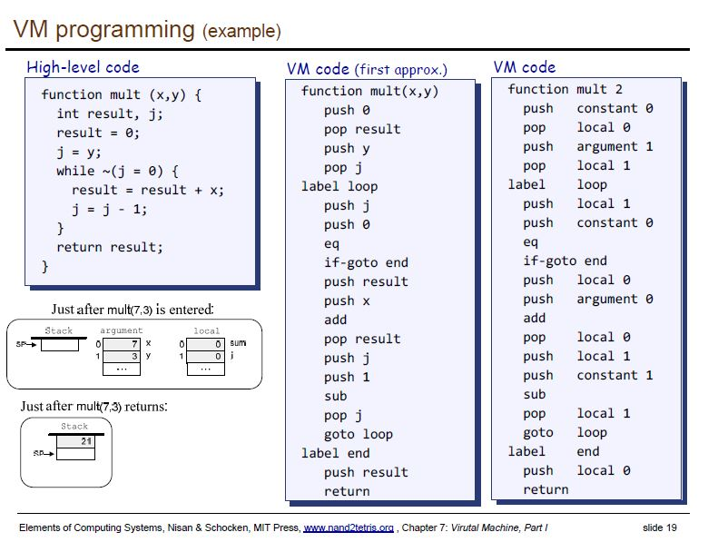
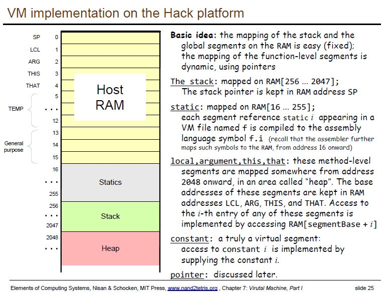
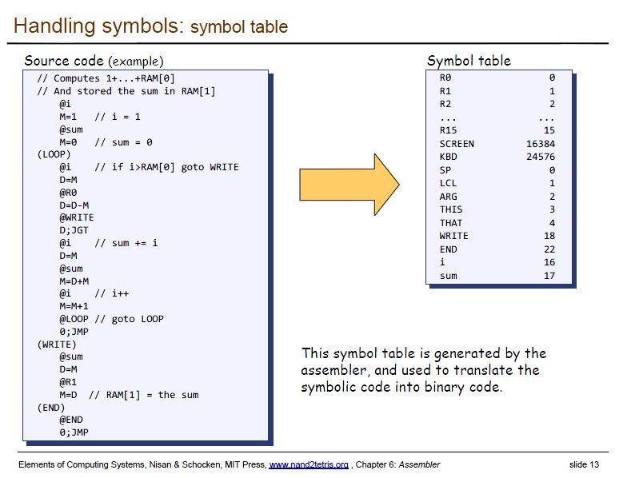
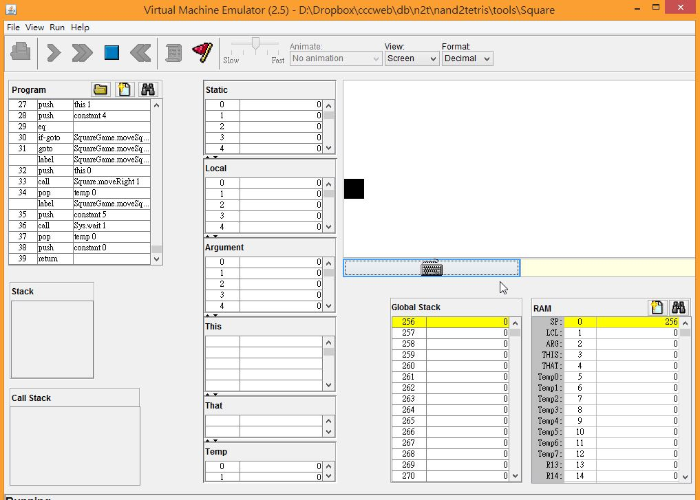
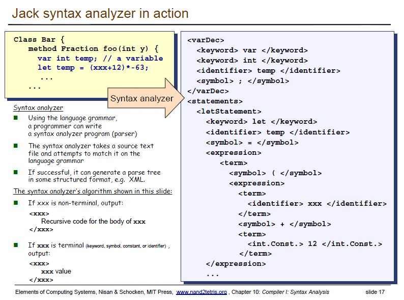
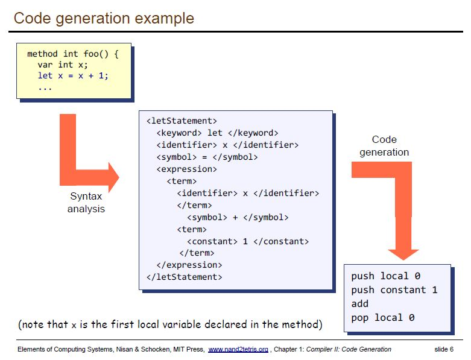
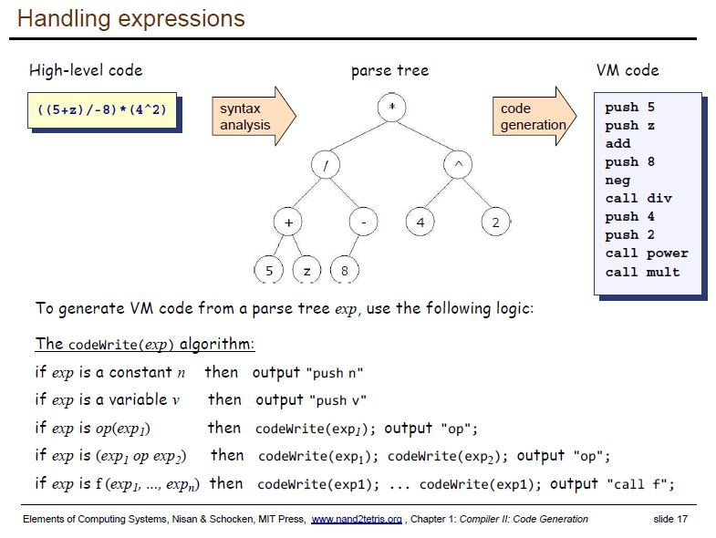
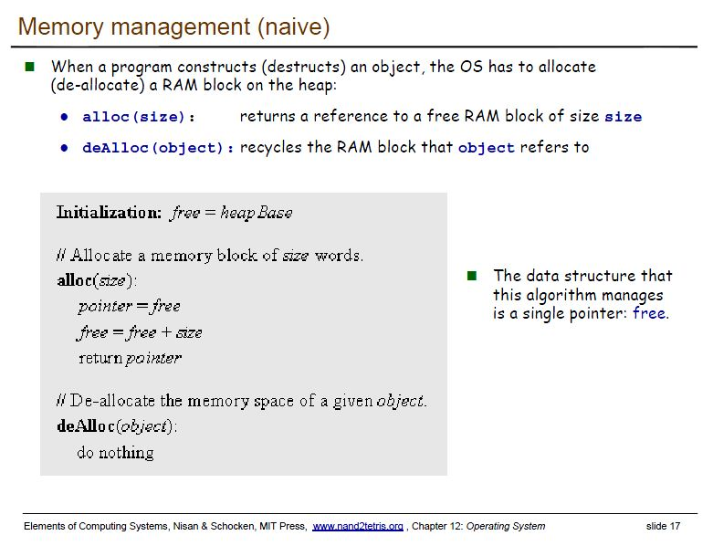
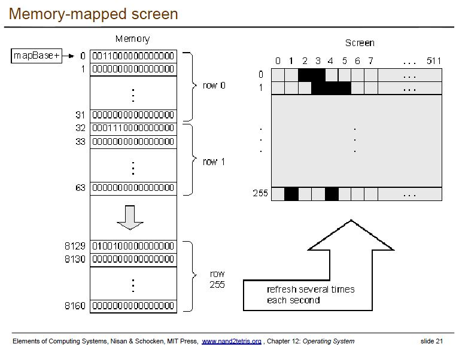

% [少年科技人雜誌](http://programmermagazine.github.com/ymag/)
% 2015 年 8 月
% 本期焦點：Nand2Tetris Part II 自學記 -- 從組譯器到作業系統

# 前言
## 編輯小語

在上期的少年科技人雜誌中，我們以 [NandToTetrix 慕課記 -- 從邏輯閘到方塊遊戲](http://ccc.nqu.edu.tw/db/ymag201506/home.html) 為主題，但是目前這門課只開了 Part I。

學了 Part I 卻沒有學完整門課，實在讓人覺得不夠過癮，因此小編決定自學 Part II ，反正 nand2tetris 的官網 <http://nand2tetris.org/> 上也已經有 Part II 所需的投影片和軟體，而且還有 [已經修完這門課的 Havivha 同學提供的 github 專案](https://github.com/havivha/Nand2Tetris) ，我想應該足以讓我們自學完成這門課了。

所以在本期雜誌中，我們就延續了上期的主題，將筆者自學的經過寫下來，分享給大家參考！

---- （「少年科技人雜誌」與「程式人雜誌」編輯 - 陳鍾誠）


## 授權聲明

本雜誌許多資料修改自維基百科，採用 創作共用：[姓名標示、相同方式分享] 授權，若您想要修改本書產生衍生著作時，至少應該遵守下列授權條件：

1. 標示原作者姓名 (包含該文章作者，若有來自維基百科的部份也請一併標示)。
3. 採用 創作共用：[姓名標示、相同方式分享] 的方式公開衍生著作。

另外、當本雜誌中有文章或素材並非採用 [姓名標示、相同方式分享] 時，將會在該文章或素材後面標示其授權，此時該文章將以該標示的方式授權釋出，請修改者注意這些授權標示，以避免產生侵權糾紛。

例如有些文章可能不希望被作為「商業性使用」，此時就可能會採用創作共用：[姓名標示、非商業性、相同方式分享] 的授權，此時您就不應當將該文章用於商業用途上。

最後、懇請勿移除公益捐贈的相關描述，以便讓愛心得以持續散播！

在本期雜誌中，我們還使用了 nand2tetris 課程中的大量習題與程式，這些習題乃是教科書 "The Elements of Computing Systems",  by Nisan and Schocken, MIT Press 的習題，這些習題與程式採用 [GNU GPL (General Public License) 授權](../http///www.gnu.org/copyleft/gpl.html.html) ，請務必遵照 GPL 的授權使用這些內容，以避免發生侵權事件。

另外、本期內容中某些截圖來自 [nand2tetris 投影片](http://www.nand2tetris.org/course.php) ，該文件並未聲明採用何種授權，使用時請注意這點，避免侵權。 在此我們僅按著作權法中的合理使用原則，擷取幾張圖片，若您是該作品擁有者且認為此擷取行為不妥，請告訴我們，我們會配合移除。


# 本期焦點： Nand2Tetris Part II 自學記 -- 從組譯器到作業系統
## Nand2Tetris Part II 自學記

在網路發達的今天，只要有自學的能力，就算沒有上學，也可以學得比其他人更好。

本期的『少年科技人雜誌』將紀錄筆者自學 Nand2Tetris Part II 的過程，並介紹相關的基礎知識給大家參考！

編輯取材的內容除了維基百科之外，還有 nand2tetris 的官網 <http://nand2tetris.org/> 中的文件，以及 [已經修完這門課的 Havivha 同學提供的 github 專案](https://github.com/havivha/Nand2Tetris) ，這應該足以讓我們自學完成這門課了。

讓我們回顧一下， nand2tetris 課程的整體結構，大致上如以下投影片所示：


而在 Part I 的習題當中，我們實作了從 nand 到 HackComputer 的所有硬體元件，而且還時做了一個組譯器，這些作業如下圖所示。


在 Part II 的習題中，我們將從『虛擬機』開始，接著實作出『編譯器』與『作業系統』，以便與 PartI 最後的『組譯器』 一起形成 HackComputer 的軟體部份。

在學習的過程中，我們會用到 <http://nand2tetris.org/software.php> 當中所提供的 CPU Emulator, VM Emulator, Assembler, Compiler, Operating System ，請先下載並安裝好這些軟體。

現在、就讓我們一起出發，完成這趟自學旅程吧！


## Nand2Tetris 第 7 週 -- VM I: Stack Arithmetic

在 Part I 第 6 週的時候，我們已經設計了 HackCPU 的組譯器，文章網址如下:

* [少年科技人雜誌 / 2015年6月號 : Nand2Tetris 第 6 週 -- 組譯器](../http///ccc.nqu.edu.tw/db/ymag201506/focus8.html.html)

如果您想要看看完整的組譯器程式碼，可以參考 github 中 havavha 同學的解答。

* <https://github.com/havivha/Nand2Tetris/tree/master/06>

當您寫完組譯器之後，其實要做出第 7 週的虛擬機就不會太困難了。

Nand2tetris 的課程就是安排得很巧妙，讓您循著階梯一步一步的向上爬，直到設計出整台電腦的軟硬體為止。


### 虛擬機

為甚麼要有虛擬機呢? 

關於這個問題，主要是因為現實世界的處理器種類太多，因此如果我們想將 n 種程式語言直接轉換成 m 種處理器的機器碼，那麼就需要寫 n*m 個程式。

舉例而言，如果要將 10 種程式語言轉換成 10 種處理器的機器碼，那就得寫 10*10=100 個編譯程式，這樣實在有點困擾。

如果我們先將這些程式語言轉換成虛擬機的中間碼 (Intermediate Representation , IR)，然後再寫程式將中間碼轉換成組合語言或機器碼，那麼就只需要 n+m = 10+10 = 20 個程式，這對程式開發而言，是一個比較省力的策略。

以下是 Nand2Tetris 虛擬機的中間碼範例，您可以看到最右邊是真正的虛擬機碼？而最左邊是一個類似 java 的高階語言，稱為 JACK。



而這兩週的習題，就是要我們實作一個可以將上述虛擬機的程式碼轉換成 HackCPU 組合語言的轉換程式。

第七週撰寫的轉換程式，主要處理的是基本運算的部分，而關於函數呼叫的轉換程式，則是第八週的習題。

### 轉換的方法

Nand2tetris 裏的虛擬機是堆疊式虛擬機，或稱堆疊機，所有需要進行加減乘除等運算的元素，都要被推入堆疊之後才能進行計算。

計算時會從堆疊中取出資料，計算完之後又會將結果推回堆疊裡面，以便下次計算時使用。

舉例而言，習題第 1 題就是要求我們寫程式將一個簡單的加法計算轉換為組合語言。

### 第 1 題: SimpleAdd.vm 轉為 SimpleAdd.asm

輸入: SimpleAdd.vm

```
push constant 7
push constant 8
add
```

但是、 HackCPU 並不是堆疊機，而且組合語言還長得頗為奇怪，因此我們要將上述指令轉為 HackCPU 的組合語言就必須先創造一個堆疊架構。

在前一章的組合語言中，其實已經保留了幾個特殊的組合語言符號，預留虛擬機使用，如下所示:

| 符號 | 說明 | 對應記憶體 |
|----|---------|-------|
| SP | 堆疊指標 | RAM[0] |
| LCL | 區域變數指標 |  RAM[1] |
| ARG | 參數指標 |  RAM[2] |
| THIS | 物件指標 |  RAM[3] |
| THAT | 陣列指標 |  RAM[4] |

於是我們就可以利用上述的 SP 作為堆疊指標，以便進行堆疊推入與彈出的動作。

在虛擬機一開始時，會將堆疊指標 SP 先設好，在 nand2tetris 專案中通常會設在 256 的地方，也就是 M[0] = 256

例如 push constant 7 就可以轉換為

```
// push constant 7
@7          // A=7              
D=A         // D=7
@SP         // A=0
A=M         // A=M[0] ; 將 A 設定為 M[0]，也就是 256
M=D         // M[A] = M[256] = D = 7 ; 於是 M[256] 位置的內容變成 7 ，達成了將 7 推入堆疊的工作。
@SP         // A=0 
M=M+1       // M[A]=M[0]; M[0]=M[0]+1 於是將堆疊指標進到下一格，這樣下次推入時才不會把 7 蓋掉，真正完成推入動作。
```

同樣的，如果是 push constant 8 這個指令，相信您也知道怎麼編碼了。

雖然 SP 代表的是 0，但是當我們用來做堆疊指標時，其實通常用的是 M[0] 的內容，一開始設定為 256，堆疊的範圍位於 RAM[256 ... 2047] 之間。

為了避免混淆，我們用 SP 代表 0，然後用 *SP 代表 M[0] 的內容 (也就是堆疊頂端的位址)。

接著要編 add 的碼，請仔細看看對應的組合語言如下:

```
// add
@SP
M=M-1      // *SP=*SP-1
@SP
A=M        // A=M[0]=*SP
D=M        // D=M[A]=M[*SP] => 第一個取出的元素，用 P1 代表。
@SP        
M=M-1      // *SP=*SP-1      
@SP
A=M        // A=M[0]=*SP
A=M        // A=M[A]=M[*SP] => 第二個取出的元素，用 P2 代表。
D=D+A      // D = D + A = P1 + P2
@SP
A=M        // A=M[0]=*SP
M=D        // M[*SP] = D = P1 + P2 => 將加法的結果 P1+P2 推回堆疊中
@SP
M=M+1      // *SP=*SP+1
```

### 第 2 題: StackTest.vm 轉為StackTest.asm

輸入: StackTest.vm

```
// Executes a sequence of arithmetic and logical operations
// on the stack. 
push constant 17
push constant 17
eq
push constant 17
push constant 16
eq
push constant 16
push constant 17
eq
push constant 892
push constant 891
lt
push constant 891
push constant 892
lt
push constant 891
push constant 891
lt
push constant 32767
push constant 32766
gt
push constant 32766
push constant 32767
gt
push constant 32766
push constant 32766
gt
push constant 57
push constant 31
push constant 53
add
push constant 112
sub
neg
and
push constant 82
or
not

```

由於上一題中我們已經解說過 push constant 與 add 的運算的組合語言，所以接下來我們只說明 and, or, not, sub, gt, eq 等指令的作法。

sub 指令和 add 很像，只不過 D=D+A 改為 D=D-A 而已。同樣的， and 指令與 add 指令也只差在將 D=D+A 改為 D=D&A 而已， or 指令則是改用 D=D|A。

接著、讓我們看看單參數的運算，像是 neg 與 not 是如何翻譯為組合語言的，以下是 neg 的例子：

```
// neg
@SP
M=M-1      // *SP=*SP-1
@SP
A=M        // A=M[0]=*SP
D=M        // D=M[A]=M[*SP] => 第一個取出的元素，用 P1 代表。
D=-D       // D= -D = -P1
@SP
A=M        // A=M[0]=*SP
M=D        // M[*SP] = D = -P1
@SP        
M=M+1      // *SP=*SP+1
```

仔細看上面的註解，您應開可以理解這種奇特組合語言的思路邏輯。

如果換成 not 運算，只不過是將上面的 D=-D 改為 D=!D 而已。

最後我們來看看像 gt 這樣的運算，其對應的組合語言如下所示:

```
// gt
@SP
M=M-1      // *SP = *SP-1
@SP
A=M        // A=M[0]=*SP
D=M        // D=M[A]=M[*SP] => 第一個取出的元素，用 P1 代表。
@SP
M=M-1      // *SP = *SP-1
@SP        // A=M[0]=*SP
A=M
A=M        // A=M[A]=M[*SP] => 第二個取出的元素，用 P2 代表。
D=A-D      // D = A-D = P2-P1
@LABEL17   
D;JGT      // if (P2-P1 > 0) goto LABEL17
@SP        
A=M        // A=M[0]=*SP
M=0        // M[*SP] = 0  ; 當 P1<=P2 時將 0 推入堆疊。 在 nand2tetris 的 JACK 語言中，用 0 代表 false
@LABEL18
0;JMP      // goto LABEL18
(LABEL17)
@SP
A=M        // A=M[0]=*SP
M=-1       // M[*SP] = -1 ; 當 P1>P2 時將 -1 推入堆疊。 在 nand2tetris 的 JACK 語言中，用 -1 代表 true
(LABEL18)
@SP
M=M+1      // *SP = *SP+1
```

### 第 3 題: BasicTest.vm 轉為 BasicTest.asm

接下來，在第 3 題的 BasicTest.vm 中，我們要處理更多類型的 push 與 pop 動作，像是 push local, push argument, pop this, .... 

以下是習題的內容。


輸入: BasicTest.vm

```
// Executes pop & push commands using the virtual memory segments.
push constant 10
pop local 0
push constant 21
push constant 22
pop argument 2
pop argument 1
push constant 36
pop this 6
push constant 42
push constant 45
pop that 5
pop that 2
push constant 510
pop temp 6
push local 0
push that 5
add
push argument 1
sub
push this 6
push this 6
add
sub
push temp 6
add
```

要做這題習題的程式之前，請務必先看過下列的 HackComputer 的記憶體配置地圖。



還有要清楚組譯器中各個分段符號的名稱代號的意義，如下圖所示。



理解了上述配置之後，就可以開始進行組合語言的翻譯了。

先讓我們看看 push argument 與 pop argument 的翻譯法，請記得 ARG 符號對應的記憶體位址為 RAM[2]，我們用 *ARG 來代表 RAM[2] 的內容。

```
// push argument 1
@1
D=A         // D = 1
@ARG
A=M         // A = M[2] = *ARG
AD=D+A      // A = D = 1+M[2] = 1+*ARG
D=M         // D = M[A] = M[1+*ARG]
@SP
A=M         // A = M[0] = *SP
M=D         // M[*SP] = D = M[1+*ARG]  ; 將 ARG[1] 推入堆疊中
@SP
M=M+1       // *SP = *SP+1

// pop argument 2
@SP
M=M-1       // *SP = *SP-1
@2
D=A         // D=2
@ARG
A=M         // A=M[2]=*ARG
AD=D+A      // A=D=2+*ARG
@R15
M=D         // M[15] = D = 2+*ARG
@SP
A=M         // A=M[0]=*SP
D=M         // D=M[A]=M[*SP] ; 取得堆疊資料 pop1
@R15
A=M         // A = M[15] = 2+*ARG
M=D         // M[A] = M[2+*ARG] = D = pop1
```

與 argument 的存取相類似的，push local 與 pop local 等運算也是利用同樣的方式，只不過將 ARG (M2) 改為 LCL (M1) 而已。

同樣的 ， push this, pop this, push that, pop that 也都是依照相同的方式，這些不同型態的堆疊存取法會對應到高階語言 JACK 的區域變數 (local, LCL)， 參數 (argument, ARG)， 物件變數 (this) 與陣列 (that, 命名有點怪 ....) 。

另外還有 temp, pointer, static 等全域變數，分別對應到 temp (5~12), static (16~255), pointer (3~4) (3 代表 this, 4 代表 that)。

接著在第四題我們就要處理 pointer 的推入與取出，如此才能在正確設定 this, that 的分段位址之後，繼續用 push this, pop this, push that, pop that 進行物件與陣列的處理。

### 第 4 題: PointerTest.vm 轉為 PointerTest.asm

輸入: PointerTest.vm

```
push constant 3030
pop pointer 0
push constant 3040
pop pointer 1
push constant 32
pop this 2
push constant 46
pop that 6
push pointer 0
push pointer 1
add
push this 2
sub
push that 6
add
```

請記得 POINTER 區段位於 RAM[3~4]，其中 RAM[3] 為 this ， RAM[4] 為 that。

```
// push pointer 1
@R4     // POINTER[1] = 3+1 = 4
D=M     // D = M[4] = POINTER[1]
@SP
A=M     // A=M[0]=*SP
M=D     // M[*SP]=POINTER[1]
@SP
M=M+1   // *SP = *SP+1

// pop pointer 1
@SP
M=M-1   // *SP = *SP-1
@SP
A=M     // A = M[0] = *SP
D=M     // D = M[*SP] = 堆疊取出的內容
@R4
M=D     // M[4]=POINTER[1]=D=堆疊取出的內容
```

### 第 5 題: StaticTest.vm 轉為 StaticTest.asm

接著是 static 變數的處理，請記得 static 變數位於 RAM[16..255] 區段中。

輸入: StaticTest.vm

```
push constant 111
push constant 333
push constant 888
pop static 8
pop static 3
pop static 1
push static 3
push static 1
sub
push static 8
add
```

其中 push static 8 與 pop static 8 轉換為組合語言後如下所示。

```
// push static 8
@StaticTest.8 // 組譯器會自動安排 StaticTest.8 的位址
D=M           // D = *StaticTest.8
@SP
A=M           // A = M[0] = *SP
M=D           // M[*SP] = D = *StaticTest.8 ; 推入 static 變數到堆疊中。
@SP
M=M+1         // *SP = *SP+1

// pop static 8
@SP
M=M-1         // *SP = *SP - 1
@SP
A=M           // A = M[0] = *SP
D=M           // D = M[*SP] ; 從堆疊取出的內容
@StaticTest.8 // 組譯器會自動安排 StaticTest.8 的位址
M=D           // *StaticTest.8 = 從堆疊取出的內容
```

有時，當筆者想不出來時，還是會看一下 havavha 同學的解答，例如他對 static 型態變數的處理如下，看完之後我再回去繼續用 javascript 與 node.js 寫自己的程式，通常就可以順利寫出了。

有 havavha 同學的幫助，真好!

```
    def _static_to_stack(self, seg, index):
        self._a_command(self._static_name(index))   # A=&func.#
        self._c_command('D', 'M')                   # D=func.#
        self._comp_to_stack('D')                    # *SP=func.#

...

   def _stack_to_static(self, seg, index):
        self._stack_to_dest('D')
        self._a_command(self._static_name(index))
        self._c_command('M', 'D')

 
```

### 結語

雖然要寫出這個程式並不算太容易，但對筆者而言，理解 HackCPU 的組合語言這部分，才是最困難的。

一旦寫出每個中間指令對應的機器碼之後，程式自然就迎刃而解了!


## Nand2Tetris 第 8 週 -- VM II: Program Control

接著在第 8 週的課程中，我們將完成整個虛擬碼轉組合語言的程式，以下是 Nand2tetris 的習題內容。

### 第 1 題: BasicLoop.vm 轉為 BasicLoop.asm

本題目的在測試跳躍指令!

輸入: BasicLoop.vm

```
push constant 0    
pop local 0        // initialize sum = 0
label LOOP_START
push argument 0    
push local 0
add
pop local 0	   // sum = sum + counter
push argument 0
push constant 1
sub
pop argument 0     // counter--
push argument 0
if-goto LOOP_START // If counter != 0, goto LOOP_START
push local 0

```

這一題的重點在於引入了 if-goto 這個指令，以下是該指令的翻譯方法。

```
// if-goto LOOP_START // If stack[top]>0, goto LOOP_START
@SP          
M=M-1                 // *SP = *SP-1
@SP
A=M                   // A=M[0]=*SP
D=M                   // D=M[A]=M[*SP] = 堆疊最上面的資料
@LOOP_START
D;JNE                 // if D != 0 goto LOOP_START
```

### 第 2 題: FibonacciSeries.vm 轉為 FibonacciSeries.asm 

輸入: FibonacciSeries.vm

```
push argument 1
pop pointer 1           // that = argument[1]

push constant 0
pop that 0              // first element = 0
push constant 1
pop that 1              // second element = 1

push argument 0
push constant 2
sub
pop argument 0          // num_of_elements -= 2 (first 2 elements are set)

label MAIN_LOOP_START

push argument 0
if-goto COMPUTE_ELEMENT // if num_of_elements > 0, goto COMPUTE_ELEMENT
goto END_PROGRAM        // otherwise, goto END_PROGRAM

label COMPUTE_ELEMENT

push that 0
push that 1
add
pop that 2              // that[2] = that[0] + that[1]

push pointer 1
push constant 1
add
pop pointer 1           // that += 1

push argument 0
push constant 1
sub
pop argument 0          // num_of_elements--

goto MAIN_LOOP_START

label END_PROGRAM
```

這題加入了 goto 指令，像是 goto MAIN_LOOP_START 與 goto END_PROGRAM 等等，以下我們將以 goto MAIN_LOOP_START 為例進行翻譯。

```
// goto MAIN_LOOP_START
@MAIN_LOOP_START
0;JMP
```

goto 的處理很簡單，基本上就是在 A 指令後面加 JMP 指令就行了。

### 第 3 題: SimpleFunction.vm 轉為 SimpleFunction.asm

輸入: SimpleFunction.vm

```
function SimpleFunction.test 2
push local 0
push local 1
add
not
push argument 0
add
push argument 1
sub
return

```

這題目的在測試函數呼叫，呼叫時必須先保留區域變數的空間，然後在離開前清空這些區域變數與呼叫前推入的參數，然後再將返回值放到堆疊頂端傳回。

這題的 return 多了設定 LCL, ARG, THIS, THAT 等系統區段變數的動作，原因是 call 呼叫的時候會推入這些變數儲存，所以才需在離開前將這些變數恢復。(關於 call 的內容請看下一題)

```
// function SimpleFunction.test 2 // 共有兩個參數
(SimpleFunction.test)
@0       // 在堆疊中保留第一個參數的空間，並且填入 0
D=A      // D=0
@SP
A=M      // A=M[0]=*SP
M=D      // M[*SP] = D = 0
@SP
M=M+1    // *SP = *SP+1
@0       // 在堆疊中保留第二個參數的空間，並且填入 0
D=A      // ...
@SP
A=M
M=D
@SP
M=M+1
...
// return
@R1       // R_FRAME = R_LCL
D=M
@R13
M=D
@5        // A=5
A=D-A     // A=FRAME-5
D=M       // D=M
@R14      // RET=*(FRAME-5)
M=D
@SP
M=M-1
@ARG      // *ARG=return value
AD=M
@R15
M=D
@SP
A=M
D=M       // D=ARG
@R15
A=M
M=D
@R2
D=M
@R0
M=D+1     // SP=ARG+1
@R13
D=M
D=D-1 
@R13
M=D
A=D
D=M
@R4
M=D       // THAT=*(FRAME-1)
@R13
D=M
D=D-1
@R13
M=D
A=D
D=M
@R3       // THIS=*(FRAME-2)
M=D
@R13
D=M
D=D-1
@R13
M=D
A=D
D=M
@R2      // ARG=*(FRAME-3)
M=D
@R13
D=M
D=D-1
@R13
M=D
A=D
D=M
@R1      // LCL=*(FRAME-4)
M=D
@R13
D=M
D=D-1
@R13
M=D
A=D      // A=RET
D=M
@R14
M=D
0;JMP    // goto RET
```

### 第 4 題: NestedCall

本題目的在測試多層函數呼叫!

輸入:  Sys.vm

```
function Sys.init 0
call Sys.main 0
pop temp 1
label LOOP
goto LOOP

// Sys.main() calls Sys.add12(123) and stores return value (135) in temp 0.
// Returns 456.

function Sys.main 0
push constant 123
call Sys.add12 1
pop temp 0
push constant 246
return

// Sys.add12(int x) returns x+12.
// It allocates 3 words of local storage to test the deallocation of local
// storage during the return.

function Sys.add12 3
push argument 0
push constant 12
add
return
```

其中的 call 是先前沒做過的，以 call Sys.add12 1 這個指令為例，翻譯成 HackCPU 組合語言如下：

```
// call Sys.add12 1
@LABEL3
D=A
@SP          // push return_address
A=M
M=D
@SP
M=M+1
@R1          // push LCL
D=M
@SP
A=M
M=D
@SP
M=M+1
@R2          // push ARG
D=M
@SP
A=M
M=D
@SP
M=M+1
@R3          // push THIS
D=M
@SP
A=M
M=D
@SP
M=M+1
@R4          // push THAT
D=M
@SP
A=M
M=D
@SP
M=M+1
@6           // ARG=SP-n-5 = SP - 6       
D=A
@R0
A=M
AD=A-D
@R2
M=D
@R0
D=M
@R1          // LCL=SP 
M=D
@Sys.add12   // goto function_name
0;JMP
(LABEL3)     // (return_address)
```

### 第 5 題: FibonacciElement

本題目的在測試啟動程式與遞迴呼叫!

輸入檔有 Main.vm 與 Sys.vm 等兩個，您應該寫一個程式可以將某資料夾下的所有 .vm 檔案都轉為 .asm 檔。

只要您上述的 function, call, return 等指令都實作正確，這題就可以順利通過了。

### 第 6 題: StaticsTest

本題目的在測試靜態變數的使用。

輸入檔有 Class1.vm , Class2.vm 與 Sys.vm  等三個，您應該寫一個程式可以將某資料夾下的所有 .vm 檔案都轉為 .asm 檔。

輸入: Class1.vm

```
function Class1.set 0
push argument 0
pop static 0
push argument 1
pop static 1
push constant 0
return

// Returns static[0] - static[1].
function Class1.get 0
push static 0
push static 1
sub
return
```

這題主要在測試 static 變數的 push, pop 處理，以 push static 1, pop static 1 為例，轉換成組合語言後如下所示。

```
// push static 1
@Class1.1    // 這裡的變數命名 Class1.1 是因為用檔名 Class1 當作靜態變數的前置名稱，加上變數名稱 1 之後，就成了 Class1.1 了。
D=M          // D=*Class1.1
@SP
A=M   
M=D          // M[*SP] = D = *Class1.1
@SP
M=M+1        // *SP=*SP+1

// pop static 1
@SP
M=M-1        // *SP=*SP-1
@SP
A=M
D=M          // D = M[*SP]
@Class1.1
M=D          // M[*Class1.1] = D
```

相較於前面幾題，這題算是相當簡單的了。

### 結語

在本文中我們僅列出少部分結果，以免直接揭露答案，希望這些結果讓您可以稍微了解整個專案到底在做甚麼，並進一步思考該如何寫出這些程式。


## Nand2Tetris 第 9 週 -- High-Level Language

在前面幾周，我們已經學過了「HackCPU 的組合語言」與 nand2tetris 中的「虛擬機中介語言」，但是這兩種語言都很難寫，因為這兩種語言都是設計給「電腦執行」的，而不是設計給人寫的。

所以、在本週的課程中，我們要學習一種稱為 JACK 的高階語言，並用這種語言寫出一些小程式，然後在接下來的兩週裏實作出 JACK 語言的編譯器，以便讓 nand2Tetris 能有完整的軟體工具鏈。

在這週的專案習題中，老師們提供了一組程式，放在 /09/Square 這個資料夾下，這是一個可以操控方塊移動的程式，您可以透過下列指令進行編譯動作

```
D:\Dropbox\cccweb\db\n2t\nand2tetris\tools>JackCompiler Square
Compiling "D:\Dropbox\cccweb\db\n2t\nand2tetris\tools\Square"
```

在編譯前資料夾裏有 Main.jack, Square.jack, SquareGame.jack 等三個 JACK 程式檔案，編譯完成之後會出現 Main.vm, Square.vm, SquareGame.vm 等三個虛擬機中間碼檔案，如下圖所示。


編譯完成後，您可以用 VMEmulator 載入該資料夾，然後選擇 No Animation 後按下執行，接著可以用「上下左右鍵」操控方塊的移動，並且可用 x 鍵讓方塊變大，用 z 鍵讓方塊縮小，如下列畫面所示。




一旦您會編譯上述專案之後，就可以開始試著用 JACK 語言寫自己的程式，而這也是本周習題要求要做的事情。

不過 nand2Tetris 網站的第九週習題並沒有指定要撰寫的程式內容，我想應該是要我們任意撰寫一個程式就行了，所以我就寫了下列程式，該程式可以計算 1+2+...+10 的結果，並且列印在螢幕上。

檔案: sum/Main.jack

```
class Main {
    function void main() {
      var int s;
      let s = Main.sum(10);
      do Output.printInt(s);
      return;
    }
    
    function int sum(int n) {
      var int i, s;
      let i=1;
      let s=0;
      while (~(i>n)) {
        let s=s+i;
        let i=i+1;
      }
      return s;
    }
}
```

寫完之後我用下列指令進行編譯 (剛開始寫的時候有些錯誤，後來我根據錯誤訊息修正後才得到正確版本)，以下是正確版的編譯結果。

```
D:\Dropbox\cccweb\db\n2t\nand2tetris\tools>JackCompiler sum
Compiling "D:\Dropbox\cccweb\db\n2t\nand2tetris\tools\sum"
```

接著我們就可以用 VMEmulator 來執行這個專案，以下是執行結果的畫面。


您可以看到上述的畫面最後印出了 55 這個計算結果，而這也正是 1+2+...+10 的結果，因此這個程式是正確的。

一旦了解了 JACK 語言的語法，我們就可以開始學習如何設計 JACK 語言的編譯器了。

這將會是下一週的主題！


## Nand2Tetris 第 10 週 -- Compiler I: Syntax Analysis

所謂的編譯器，是一個將高階語言轉換成低階語言的程式。

在 nand2tetris 課程中，高階語言就是上一週介紹的 JACK 語言，而低階語言就是第 7-8 週介紹的虛擬機中介語言。

這兩週的任務就是要發展一個可以將 JACK 語言編譯成虛擬機語言的程式。

一個編譯器通常可以進一步分成好幾個組件，最簡單的分法是分成 1. 詞彙掃描 (Lexer) 2. 語法剖析 (Parser) 3. 目的碼產生 (Code Generator) 。

### 詞彙掃描

詞彙掃描的工作，是將輸入程式的詞彙一個一個取出來，每次取一個。

舉例而言，以下是 nand2tetris 第 10 週投影片的一個詞彙掃描結果，您可以看到左邊的 `if (x < 153) {let city == ”Paris”;}` 被斷成了一個一個的詞彙，變成像 `|if|(|x|<|153|)|{|let|city|=|”Paris”|;|}|` 的樣子。只是途中的切分結果最後是用 XML 標記語言的方式呈現而已。


這種詞彙切分的程式寫起來並不難，您可以用正規表達式輕易地寫出來，或者是直接寫個小程式逐字讀取也行。

### 語法剖析

一旦詞彙切分的程式建構完成，我們就可以進一步撰寫語法剖析的程式，但是要撰寫這類程式之前，我們必須先了解「語法」的概念。

還記得剛學英文的時候，老師會教所謂的文法，然後我們會看到像下列這樣的語法樹結構。


這種結構也可以用在描述程式的語法上，以下就是一個簡單的「數學運算式」語法。


一但這種語法建構完成之後，我們就可以將按照語法寫出「剖析程式」(Parser) ，這樣就能完成語法剖析的動作了。

若想進一步理解有關語言處理和語法剖析的技術，也可以參考筆者寫的下列電子書。

* [語言處理技術](http://ccckmit.github.io/BookLanguageProcessing/)

在 nand2tetris 第 10 週投影片中描述了完整的 JACK 語言語法，如以下兩張圖片所示。


一但您完成了第 10 週作業中的剖析器之後，就可以把 JACK 語言轉換成以 XML 結構輸出的語法樹，以下是一個範例。



當剖析器完成之後，我們就可以開始插入輸出虛擬機中間碼的程式，將 JACK 語言的程式轉換成中間碼，然後再用先前的程式轉換成組合語言，最後用組譯器轉換成機器碼。

這樣我們就能完成一個高階語言編譯器了。


## Nand2Tetris 第 11 週 -- Compiler II: Code Generation

在第 10 週的課程中，我們學習了如何設計一個剖析器，接著我們可以站在這個基礎上，學習如何設計「程式碼產生器」，這樣就可以完成整個編譯器的程式。

下圖顯示了「剖析器」(語法分析) 與「程式碼產生器」的分工結構，一旦辨認出語法結構後，就可以進行「程式碼產生」的動作。



舉例而言，若有一個 `(5+z))/-8)*(4^2)` 的運算式，經過剖析後會形成下圖中的語法樹，接著就可以用 codeWrite(exp) 中的程式碼產生規則，產生該運算式的低階程式碼。



而對於那些比較複雜的控制邏輯，則必須搭配有條件的跳躍指令才能做到，下圖顯示了 if, while 等語句是如何被轉換成低階程式碼的。


有了以上這些概念之後，您就掌握了撰寫本週習題的關鍵，可以開始撰寫編譯器中的「程式碼產生器」部分了。

當然，還有很多其他語法我們這裡沒有詳細說明的，您可以進一步參考「第 11 週投影片」的內容，還有以下 havivha 同學的第 11 週作業，以進一步理解完整的實作方法。

* <https://github.com/havivha/Nand2Tetris/tree/master/11/JackAnalyzer> 


## Nand2Tetris 第 12 週 -- Operating System

雖然在 11 週我們已經學習了如何設計 JACK 語言的編譯器，但是光靠這個編譯器，還是很難完成一個像「方塊遊戲」這樣的程式，因為還有很多基礎的函式庫未完成。

舉例而言，HackCPU 當中沒有硬體的乘法動作，於是我們需要用加減法來完成可以進行「乘除法」的函式庫。

另外、我們還需要撰寫「記憶體管理、字型繪製、基本繪圖、鍵盤與銀幕輸出入」等函式庫，這樣才能夠讓我們在寫程式的時候可以比較輕鬆愉快一些。

而這些函式庫集合起來，就是一個超小型的作業系統。 (當然、這和完整的作業系統比起來，還有很長一段距離)。

在第 12 週的作業中，我們需要完成 Math.jack, Memory.jack, String.jack, Array.jack, Output.jack, Screen.jack, Keyboard.jack, Sys.jack 等程式，以便形成這個微型作業系統。

在這週的程式當中，最基礎且關鍵的是 Memory 這個物件，Memory 物件與 Array 緊密搭配，形成的整個記憶體管理系統，其 JACK 語言的介面如下所示。

檔案: Array.jack

```
class Array {
    function Array new(int size)
    method void dispose()
}
```


檔案: Memory.jack

```
class Memory {
  function int peek(int address)
  function void poke(int address, int value)
  function Array alloc(int size)
  function void deAlloc(Array o)
}
```

Memory 物件會在 alloc(int size) 呼叫時分配一個 Array 空間，然後在 deAlloc(Array o) 呼叫時釋放 o 這個 Array 所佔的空間，其功能如下圖所示。



記憶體管理更詳細的演算法可參考下列圖片。


在上述的空間分配算法中，一個自由區塊的前兩個 word 分別存放「區塊大小與下一個區塊的指標」，一開始只有一個位於 2048~16384 之間的超大區塊，然後在分配 alloc(int size) 的過程當中會不斷切分，而在釋放 deAlloc(Array o) 的過程中有可能進行合併。

一個已經分配使用，大小為 size 的區塊，事實上占用 size+1 的記憶體大小，其中位於開頭的 word 用來儲存大小，因此格式為 (size, Array) 。

除了 Memory 和 Array 物件之外，還有 Math, String, Output, Screen, Keyboard, Sys 等物件，其 JACK 語言的物件與函數列出如下。

檔案: String.jack

```
class String {
  constructor String new(int maxLength)
  method void dispose()
  method int length()
  method char charAt(int j)
  method void setCharAt(int j, char c)
  method String appendChar(char c)
  method void eraseLastChar()
  method int intValue()
  method void setInt(int j)
  function char backSpace()
  function char doubleQuote()
  function char newLine()
}
```

檔案: Keyboard.jack

```
class Keyboard {
  function char keyPressed()
  function char readChar()
  function String readLine(String message)
  function int readInt(String message)
}
```

檔案: Math.jack

```
class Math {
  function void init()
  function int abs(int x)
  function int multiply(int x, int y)
  function int divide(int x, int y)
  function int min(int x, int y)
  function int max(int x, int y)
  function int sqrt(int x)
}
```

檔案: Sys.jack

```
class Sys {
  function void halt():
  function void error(int errorCode)
  function void wait(int duration)
}
```

檔案: Screen.jack

```
class Screen {
  function void clearScreen()
  function void setColor(boolean b)
  function void drawPixel(int x, int y)
  function void drawLine(int x1, int y1, int x2, int y2)
  function void drawRectangle(int x1, int y1,int x2, int y2)
  function void drawCircle(int x, int y, int r)
}
```

檔案: Output.jack

```
class Output {
  function void moveCursor(int i, int j)
  function void printChar(char c)
  function void printString(String s)
  function void printInt(int i)
  function void println()
  function void backSpace()
}
```

上面最後一個物件 Output 必須要將「英文與數字」的字型輸出到螢幕上，這必須用輸出到螢幕記憶體區的方式輸出， HackComputer 的螢幕記憶體區位於 16384 開始的 8192 (8k) 記憶體區塊。我們只要將對應的 bit 設為 0 就會顯示白色，如果設為 1 就會顯示黑色。以下是這種記憶體映射方法的示意圖。



另外、對於鍵盤物件 Keyboard 物件而言，其記憶體映射位址在 24576 ，我們只要讀取該處的 16 位元字組，就可以知道到底鍵盤輸入碼為何？

到此我們已經大致描述了這個作業系統實作時所需要理解的基礎知識了，剩下的就是實作部份了。

當您實作完這些程式之後，您就完成了 nand2tetris 這門課的所有習題了。

現在，您已經從頭到尾，從硬體到軟體，親手打造了一台完整的電腦，恭喜您!


## Nand2Tetris 課程學習心得

經過了非常艱苦的學習過程，終於透過 nand2tetris 學會了怎麼實作一台電腦。雖然學得很累，但是收穫也很多。

從 nand2tetris 課程當中我觀察到以下幾點：

1. 對於這種實作型課程而言， nand2tetris 巧妙的安排了每一個習題，通常每個習題都有驗證程式，能讓你確認自己的實作結果是否正確，這對學習者非常有幫助。
2. 雖然給了驗證程式，但是老師卻刻意將實作內容抽掉，但是留下框架，這讓學生能夠清楚地了解到底需要做甚麼專案，卻又必須仔細思考並想辦法填入對應的程式，這種以習題為主的學習方法，在實作性的課程上感覺非常有效。
3. 習題的安排都是由淺入深，就像階梯一般，可以讓學習者一級一級的往上爬，於是不容易出現跳空的情況，這有效降低了專案對學習者的難度，當您完成了前一題之後，通常就具備進入下一題的基礎了。
4. 投影片的內容雖然不多，但是幾乎都針對習題搭好了足夠的知識基礎，這對學習者而言是非常有幫助的。

基本上這個課程的安排方法就是，老師們先自己實作出所有的程式一遍之後，把模組框架留下，但是卻把實作內容移除，這樣自然就形成了一組習題，也就是請學員將實作部份完成，這種方法對學習程式而言是很好的方法。

另外、在網路發達的今日，您只要善用網路資源，就能夠學會絕大多數您想學的技術或知識，像是透過 nand2tetris 您就可以完整的學會實作一台電腦軟硬體的方法。

MOOC 的影片對學習而言是有幫助的，但是即使沒有影片，我們也能透過網路教材順利地學會 Part II 的內容。

雖然網路上已經有人給出習題解答，但是最好能夠在不看習題解答的情況下自行思考，這樣的學習效果會比較好，但是如我真的想不出來的時候，稍微參考一下這些解答，會是非常有幫助的。

解答就像是老師一樣，當您想不出來的時候，就提出問題問老師，然後看了對應的內容與解答後再繼續思考，這樣才不至於被卡住太久而喪失學習熱誠，所以在自學的時候，如果沒有老師與同學可以請教，那麼就先思考，真的想不出來的時候就參考解答吧!


# 雜誌訊息

## 讀者訂閱
程式人雜誌是一個結合「開放原始碼與公益捐款活動」的雜誌，簡稱「開放公益雜誌」。開放公益雜誌本著「讀書做善事、寫書做公益」的精神，我們非常歡迎程式人認養專欄、或者捐出您的網誌，如果您願意成為本雜誌的專欄作家，請加入 [程式人雜誌社團] 一同共襄盛舉。

我們透過發行這本雜誌，希望讓大家可以讀到想讀的書，學到想學的技術，同時也讓寫作的朋友的作品能產生良好價值 – 那就是讓讀者根據雜誌的價值捐款給慈善團體。
讀雜誌做公益也不需要有壓力，您不需要每讀一本就急著去捐款，您可以讀了十本再捐，或者使用固定的月捐款方式，當成是雜誌訂閱費，或者是季捐款、一年捐一次等都 OK ! 甚至是單純當個讀者我們也都很歡迎！

本雜誌每期參考價：NT 50 元，如果您喜歡本雜誌，請將書款捐贈公益團體。例如可捐贈給「羅慧夫顱顏基金會 彰化銀行(009) 帳號：5234-01-41778-800」。(若匯款要加註可用「程式人雜誌」五個字)

## 投稿須知

*給專欄寫作者：* 做公益不需要有壓力。如果您願意撰寫專欄，您可以輕鬆的寫，如果當月的稿件出不來，我們會安排其他稿件上場。

*給網誌捐贈者：* 如果您沒時間寫專欄或投稿，沒關係，只要將您的網誌以 [創作共用的「姓名標示、非商業性、相同方式分享」授權] 並通知我們，我們會自動從中選取需要的文章進行編輯，放入適當的雜誌當中出刊。

*給文章投稿者：* 程式人雜誌非常歡迎您加入作者的行列，如果您想撰寫任何文章或投稿，請用 markdown 或 LibreOffice 編輯好您的稿件，並於每個月 25 日前投稿到[程式人雜誌社團] 的檔案區，我們會盡可能將稿件編入隔月1號出版程式人雜誌當中，也歡迎您到社團中與我們一同討論。

如果您要投稿給程式人雜誌，我們最希望的格式是採用 markdown 的格式撰寫，然後將所有檔按壓縮為 zip 上傳到社團檔案區給我們， 如您想學習 markdown 的撰寫出版方式，可以參考 [看影片學 markdown 編輯出版流程] 一文。

如果您無法採用 markdown 的方式撰寫，也可以直接給我們您的稿件，像是 MS. Word 的 doc 檔或 LibreOffice 的 odt 檔都可以，我們
會將這些稿件改寫為 markdown 之後編入雜誌當中。

## 參與編輯
您也可以擔任程式人雜誌的編輯，甚至創造一個全新的公益雜誌，我們誠摯的邀請您加入「開放公益出版」的行列，如果您想擔任編輯或創造新雜誌，也歡迎到 [程式人雜誌社團] 來與我們討論相關事宜。

## 公益資訊

| 公益團體 |  聯絡資訊        |   服務對象    |  捐款帳號 |
|------------|--------------------|-----------------|----------------------|
| 財團法人羅慧夫顱顏基金會 | <http://www.nncf.org/> <br/> <lynn@nncf.org> <br/> 02-27190408分機 232  | 顱顏患者 (如唇顎裂、小耳症或其他罕見顱顏缺陷） | 銀行：009 彰化銀行民生分行 <br/> 帳號：5234-01-41778-800 |
| 社團法人台灣省兒童少年成長協會 | <http://www.cyga.org/> <br/> <cyga99@gmail.com> <br/> 04-23058005 |   單親、隔代教養.弱勢及一般家庭之兒童青少年 |  銀行：新光銀行 <br/> 戶名：台灣省兒童少年成長協會 <br/>  帳號：103-0912-10-000212-0 |


