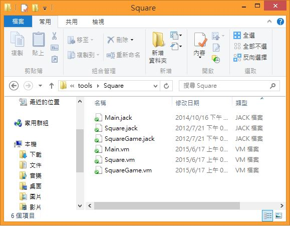
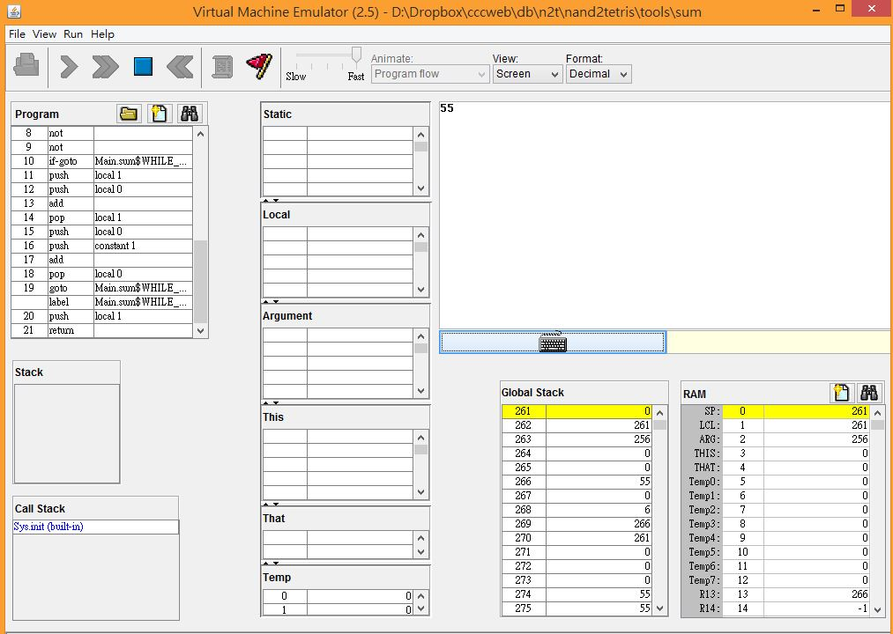

## Nand2Tetris 第 9 週 -- High-Level Language

在前面幾周，我們已經學過了「HackCPU 的組合語言」與 nand2tetris 中的「虛擬機中介語言」，但是這兩種語言都很難寫，因為這兩種語言都是設計給「電腦執行」的，而不是設計給人寫的。

所以、在本週的課程中，我們要學習一種稱為 JACK 的高階語言，並用這種語言寫出一些小程式，然後在接下來的兩週裏實作出 JACK 語言的編譯器，以便讓 nand2Tetris 能有完整的軟體工具鏈。

在這週的專案習題中，老師們提供了一組程式，放在 /09/Square 這個資料夾下，這是一個可以操控方塊移動的程式，您可以透過下列指令進行編譯動作

```
D:\Dropbox\cccweb\db\n2t\nand2tetris\tools>JackCompiler Square
Compiling "D:\Dropbox\cccweb\db\n2t\nand2tetris\tools\Square"
```

在編譯前資料夾裏有 Main.jack, Square.jack, SquareGame.jack 等三個 JACK 程式檔案，編譯完成之後會出現 Main.vm, Square.vm, SquareGame.vm 等三個虛擬機中間碼檔案，如下圖所示。



編譯完成後，您可以用 VMEmulator 載入該資料夾，然後選擇 No Animation 後按下執行，接著可以用「上下左右鍵」操控方塊的移動，並且可用 x 鍵讓方塊變大，用 z 鍵讓方塊縮小，如下列畫面所示。


一旦您會編譯上述專案之後，就可以開始試著用 JACK 語言寫自己的程式，而這也是本周習題要求要做的事情。

不過 nand2Tetris 網站的第九週習題並沒有指定要撰寫的程式內容，我想應該是要我們任意撰寫一個程式就行了，所以我就寫了下列程式，該程式可以計算 1+2+...+10 的結果，並且列印在螢幕上。

檔案: sum/Main.jack

```
class Main {
    function void main() {
      var int s;
      let s = Main.sum(10);
      do Output.printInt(s);
      return;
    }
    
    function int sum(int n) {
      var int i, s;
      let i=1;
      let s=0;
      while (~(i>n)) {
        let s=s+i;
        let i=i+1;
      }
      return s;
    }
}
```

寫完之後我用下列指令進行編譯 (剛開始寫的時候有些錯誤，後來我根據錯誤訊息修正後才得到正確版本)，以下是正確版的編譯結果。

```
D:\Dropbox\cccweb\db\n2t\nand2tetris\tools>JackCompiler sum
Compiling "D:\Dropbox\cccweb\db\n2t\nand2tetris\tools\sum"
```

接著我們就可以用 VMEmulator 來執行這個專案，以下是執行結果的畫面。




您可以看到上述的畫面最後印出了 55 這個計算結果，而這也正是 1+2+...+10 的結果，因此這個程式是正確的。

一旦了解了 JACK 語言的語法，我們就可以開始學習如何設計 JACK 語言的編譯器了。

這將會是下一週的主題！


