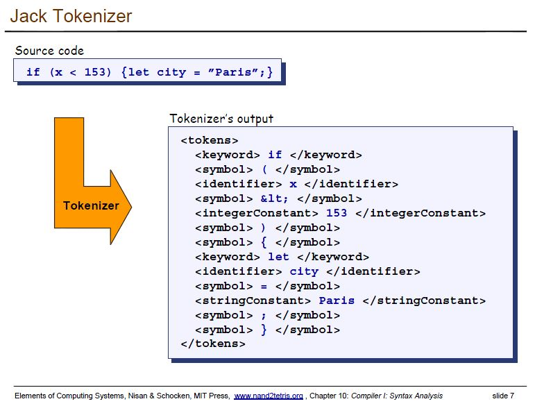
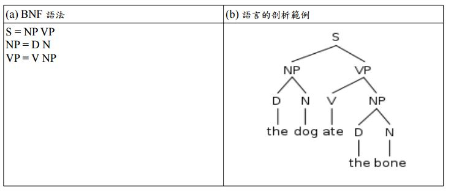
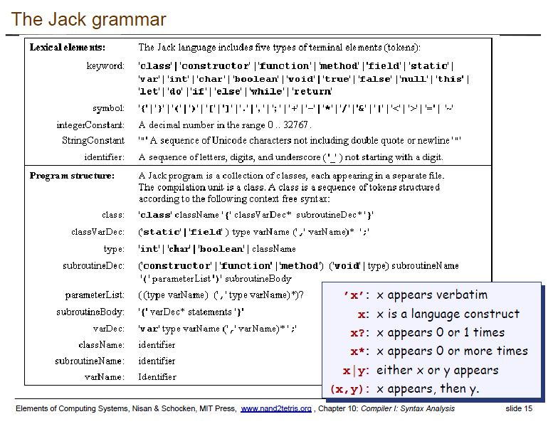
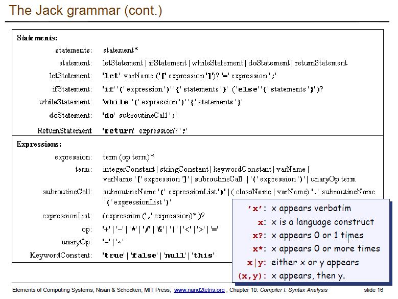

## Nand2Tetris 第 10 週 -- Compiler I: Syntax Analysis

所謂的編譯器，是一個將高階語言轉換成低階語言的程式。

在 nand2tetris 課程中，高階語言就是上一週介紹的 JACK 語言，而低階語言就是第 7-8 週介紹的虛擬機中介語言。

這兩週的任務就是要發展一個可以將 JACK 語言編譯成虛擬機語言的程式。

一個編譯器通常可以進一步分成好幾個組件，最簡單的分法是分成 1. 詞彙掃描 (Lexer) 2. 語法剖析 (Parser) 3. 目的碼產生 (Code Generator) 。

### 詞彙掃描

詞彙掃描的工作，是將輸入程式的詞彙一個一個取出來，每次取一個。

舉例而言，以下是 nand2tetris 第 10 週投影片的一個詞彙掃描結果，您可以看到左邊的 `if (x < 153) {let city == ”Paris”;}` 被斷成了一個一個的詞彙，變成像 `|if|(|x|<|153|)|{|let|city|=|”Paris”|;|}|` 的樣子。只是途中的切分結果最後是用 XML 標記語言的方式呈現而已。

這種詞彙切分的程式寫起來並不難，您可以用正規表達式輕易地寫出來，或者是直接寫個小程式逐字讀取也行。

### 語法剖析

一旦詞彙切分的程式建構完成，我們就可以進一步撰寫語法剖析的程式，但是要撰寫這類程式之前，我們必須先了解「語法」的概念。

還記得剛學英文的時候，老師會教所謂的文法，然後我們會看到像下列這樣的語法樹結構。

這種結構也可以用在描述程式的語法上，以下就是一個簡單的「數學運算式」語法。

一但這種語法建構完成之後，我們就可以將按照語法寫出「剖析程式」(Parser) ，這樣就能完成語法剖析的動作了。

若想進一步理解有關語言處理和語法剖析的技術，也可以參考筆者寫的下列電子書。

* [語言處理技術](http://ccckmit.github.io/BookLanguageProcessing/)

在 nand2tetris 第 10 週投影片中描述了完整的 JACK 語言語法，如以下兩張圖片所示。

一但您完成了第 10 週作業中的剖析器之後，就可以把 JACK 語言轉換成以 XML 結構輸出的語法樹，以下是一個範例。

當剖析器完成之後，我們就可以開始插入輸出虛擬機中間碼的程式，將 JACK 語言的程式轉換成中間碼，然後再用先前的程式轉換成組合語言，最後用組譯器轉換成機器碼。

這樣我們就能完成一個高階語言編譯器了。

