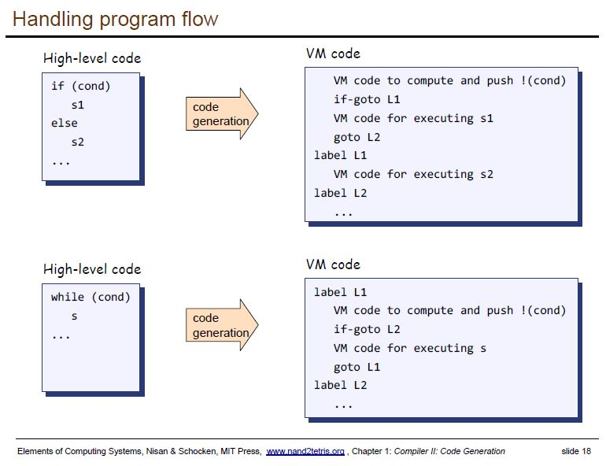

## Nand2Tetris 第 11 週 -- Compiler II: Code Generation

在第 10 週的課程中，我們學習了如何設計一個剖析器，接著我們可以站在這個基礎上，學習如何設計「程式碼產生器」，這樣就可以完成整個編譯器的程式。

下圖顯示了「剖析器」(語法分析) 與「程式碼產生器」的分工結構，一旦辨認出語法結構後，就可以進行「程式碼產生」的動作。

舉例而言，若有一個 `(5+z))/-8)*(4^2)` 的運算式，經過剖析後會形成下圖中的語法樹，接著就可以用 codeWrite(exp) 中的程式碼產生規則，產生該運算式的低階程式碼。

而對於那些比較複雜的控制邏輯，則必須搭配有條件的跳躍指令才能做到，下圖顯示了 if, while 等語句是如何被轉換成低階程式碼的。

有了以上這些概念之後，您就掌握了撰寫本週習題的關鍵，可以開始撰寫編譯器中的「程式碼產生器」部分了。

當然，還有很多其他語法我們這裡沒有詳細說明的，您可以進一步參考「第 11 週投影片」的內容，還有以下 havivha 同學的第 11 週作業，以進一步理解完整的實作方法。

* <https://github.com/havivha/Nand2Tetris/tree/master/11/JackAnalyzer> 

