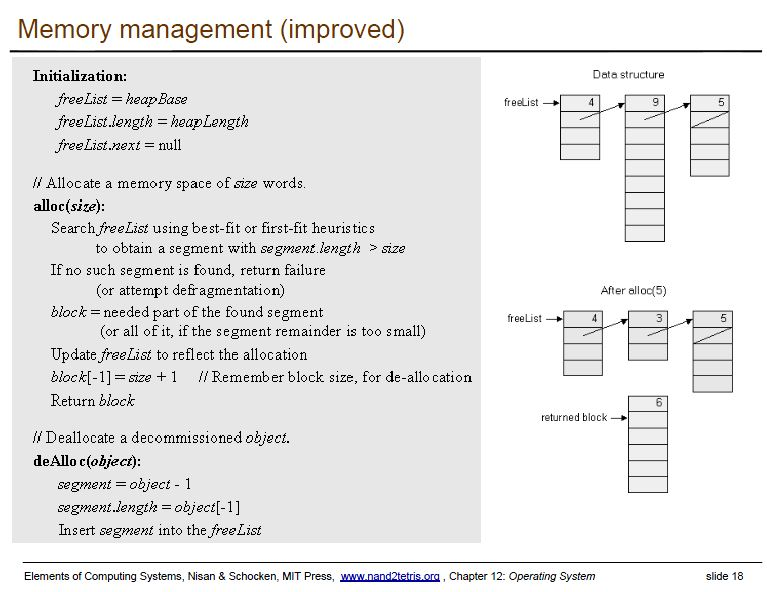

## Nand2Tetris 第 12 週 -- Operating System

雖然在 11 週我們已經學習了如何設計 JACK 語言的編譯器，但是光靠這個編譯器，還是很難完成一個像「方塊遊戲」這樣的程式，因為還有很多基礎的函式庫未完成。

舉例而言，HackCPU 當中沒有硬體的乘法動作，於是我們需要用加減法來完成可以進行「乘除法」的函式庫。

另外、我們還需要撰寫「記憶體管理、字型繪製、基本繪圖、鍵盤與銀幕輸出入」等函式庫，這樣才能夠讓我們在寫程式的時候可以比較輕鬆愉快一些。

而這些函式庫集合起來，就是一個超小型的作業系統。 (當然、這和完整的作業系統比起來，還有很長一段距離)。

在第 12 週的作業中，我們需要完成 Math.jack, Memory.jack, String.jack, Array.jack, Output.jack, Screen.jack, Keyboard.jack, Sys.jack 等程式，以便形成這個微型作業系統。

在這週的程式當中，最基礎且關鍵的是 Memory 這個物件，Memory 物件與 Array 緊密搭配，形成的整個記憶體管理系統，其 JACK 語言的介面如下所示。

檔案: Array.jack

```
class Array {
    function Array new(int size)
    method void dispose()
}
```


檔案: Memory.jack

```
class Memory {
  function int peek(int address)
  function void poke(int address, int value)
  function Array alloc(int size)
  function void deAlloc(Array o)
}
```

Memory 物件會在 alloc(int size) 呼叫時分配一個 Array 空間，然後在 deAlloc(Array o) 呼叫時釋放 o 這個 Array 所佔的空間，其功能如下圖所示。


記憶體管理更詳細的演算法可參考下列圖片。



在上述的空間分配算法中，一個自由區塊的前兩個 word 分別存放「區塊大小與下一個區塊的指標」，一開始只有一個位於 2048~16384 之間的超大區塊，然後在分配 alloc(int size) 的過程當中會不斷切分，而在釋放 deAlloc(Array o) 的過程中有可能進行合併。

一個已經分配使用，大小為 size 的區塊，事實上占用 size+1 的記憶體大小，其中位於開頭的 word 用來儲存大小，因此格式為 (size, Array) 。

除了 Memory 和 Array 物件之外，還有 Math, String, Output, Screen, Keyboard, Sys 等物件，其 JACK 語言的物件與函數列出如下。

檔案: String.jack

```
class String {
  constructor String new(int maxLength)
  method void dispose()
  method int length()
  method char charAt(int j)
  method void setCharAt(int j, char c)
  method String appendChar(char c)
  method void eraseLastChar()
  method int intValue()
  method void setInt(int j)
  function char backSpace()
  function char doubleQuote()
  function char newLine()
}
```

檔案: Keyboard.jack

```
class Keyboard {
  function char keyPressed()
  function char readChar()
  function String readLine(String message)
  function int readInt(String message)
}
```

檔案: Math.jack

```
class Math {
  function void init()
  function int abs(int x)
  function int multiply(int x, int y)
  function int divide(int x, int y)
  function int min(int x, int y)
  function int max(int x, int y)
  function int sqrt(int x)
}
```

檔案: Sys.jack

```
class Sys {
  function void halt():
  function void error(int errorCode)
  function void wait(int duration)
}
```

檔案: Screen.jack

```
class Screen {
  function void clearScreen()
  function void setColor(boolean b)
  function void drawPixel(int x, int y)
  function void drawLine(int x1, int y1, int x2, int y2)
  function void drawRectangle(int x1, int y1,int x2, int y2)
  function void drawCircle(int x, int y, int r)
}
```

檔案: Output.jack

```
class Output {
  function void moveCursor(int i, int j)
  function void printChar(char c)
  function void printString(String s)
  function void printInt(int i)
  function void println()
  function void backSpace()
}
```

上面最後一個物件 Output 必須要將「英文與數字」的字型輸出到螢幕上，這必須用輸出到螢幕記憶體區的方式輸出， HackComputer 的螢幕記憶體區位於 16384 開始的 8192 (8k) 記憶體區塊。我們只要將對應的 bit 設為 0 就會顯示白色，如果設為 1 就會顯示黑色。以下是這種記憶體映射方法的示意圖。


另外、對於鍵盤物件 Keyboard 物件而言，其記憶體映射位址在 24576 ，我們只要讀取該處的 16 位元字組，就可以知道到底鍵盤輸入碼為何？

到此我們已經大致描述了這個作業系統實作時所需要理解的基礎知識了，剩下的就是實作部份了。

當您實作完這些程式之後，您就完成了 nand2tetris 這門課的所有習題了。

現在，您已經從頭到尾，從硬體到軟體，親手打造了一台完整的電腦，恭喜您!


